# Engine comparison

Time per operation; lower is better. Every kind answered the same questions with the same results before being timed. A ratio in parentheses is our time divided by the like-for-like SpiceDB time: memory against spicedb-memdb, the postgres kinds against spicedb-postgres (or spicedb-memdb when that is the only one). Below 1× we are faster. An empty cell is an answer that kind cannot give.

## Summary: geometric mean of our time ÷ SpiceDB time

| scenario | memory vs spicedb-memdb | memory+index vs spicedb-postgres | postgres vs spicedb-postgres | postgres+closure vs spicedb-postgres | postgres+sets vs spicedb-postgres |
|---|---:|---:|---:|---:|---:|
| **all scenarios** | **2.30×** (85 ops) | **0.03×** (85 ops) | **1.32×** (85 ops) | **1.41×** (85 ops) | **1.27×** (85 ops) |
| pattern/name=wide_team | 2.00× | 0.02× | 2.58× | 1.83× | 1.54× |
| pattern/name=deep_nesting | 0.02× | 0.01× | 0.54× | 4.92× | 5.12× |
| pattern/name=hub_user | 0.84× | 0.01× | 1.48× | 1.38× | 1.06× |
| pattern/name=needle | 3.14× | 0.00× | 1.07× | 1.47× | 1.14× |
| pattern/name=fan_in | 7.78× | 0.03× | 36.4× | 1.10× | 0.99× |
| pattern/name=dag | 0.88× | 0.02× | 1.50× | 1.02× | 1.22× |
| pattern/name=arrow_chain | 0.26× | 0.01× | 11.9× | 21.5× | 1.18× |
| pattern/name=wildcard_ban | 3.69× | 0.03× | 2.12× | 1.87× | 1.93× |
| scale/resources=1000/density=10/path=direct | 0.35× | 0.02× | 0.80× | 1.19× | 1.21× |
| scale/resources=1000/density=90/path=direct | 0.49× | 0.03× | 0.74× | 1.00× | 1.08× |
| scale/resources=1000/density=10/path=team | 0.42× | 0.02× | 0.96× | 1.28× | 1.20× |
| scale/resources=10000/density=10/path=direct | 2.92× | 0.04× | 0.73× | 0.96× | 0.99× |
| scale/resources=10000/density=90/path=direct | 2.94× | 0.06× | 0.70× | 0.87× | 1.07× |
| scale/resources=10000/density=10/path=team | 3.50× | 0.04× | 0.82× | 1.31× | 1.45× |
| scale/resources=100000/density=10/path=direct | 19.9× | 0.21× | 0.66× | 0.84× | 1.07× |
| scale/resources=100000/density=90/path=direct | 20.5× | 0.21× | 0.65× | 0.82× | 0.94× |
| scale/resources=100000/density=10/path=team | 26.4× | 0.22× | 0.76× | 1.75× | 1.93× |

## pattern/name=wide_team

| op | memory | memory+index | postgres | postgres+closure | postgres+sets | spicedb-memdb | spicedb-postgres |
|---|---:|---:|---:|---:|---:|---:|---:|
| check_hit | 2.9 ms (8.12×) | 2.0 µs (0.00×) | 4.7 ms (7.30×) | 648.6 µs (1.01×) | 815.8 µs (1.27×) | 362.3 µs | 643.1 µs |
| check_miss | 2.9 ms (8.20×) | 6.6 µs (0.01×) | 4.9 ms (7.76×) | 1.0 ms (1.60×) | 807.4 µs (1.28×) | 354.3 µs | 629.1 µs |
| lookup_one_member | 806.9 µs (2.14×) | 2.3 µs (0.00×) | 3.5 ms (5.26×) | 892.3 µs (1.34×) | 682.3 µs (1.03×) | 377.6 µs | 663.6 µs |
| subjects_all | 3.8 ms (0.71×) | 781.9 µs (0.14×) | 6.0 ms (1.10×) | 7.3 ms (1.35×) | 2.5 ms (0.46×) | 5.3 ms | 5.4 ms |
| bulk_200 | 5.8 ms (1.62×) | 565.9 µs (0.13×) | 8.1 ms (1.84×) | 102.3 ms (23.1×) | 116.2 ms (26.2×) | 3.6 ms | 4.4 ms |
| toggle_grant | 328.2 µs (0.39×) | 332.0 µs (0.08×) | 2.0 ms (0.49×) | 2.3 ms (0.56×) | 2.7 ms (0.66×) | 840.9 µs | 4.1 ms |

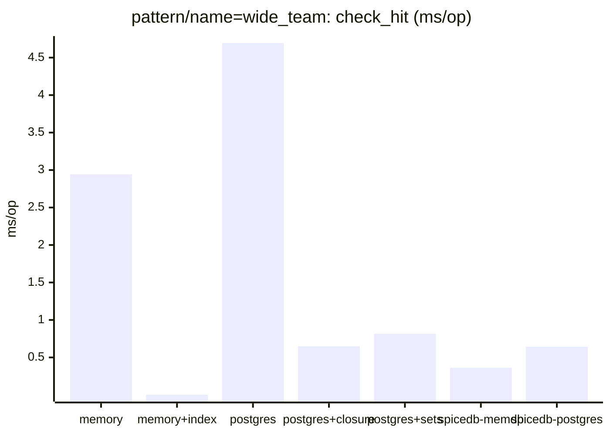
```mermaid
xychart-beta
    title "pattern/name=wide_team: check_hit (ms/op)"
    x-axis ["memory", "memory+index", "postgres", "postgres+closure", "postgres+sets", "spicedb-memdb", "spicedb-postgres"]
    y-axis "ms/op"
    bar [2.943, 0.002, 4.695, 0.649, 0.816, 0.362, 0.643]
```

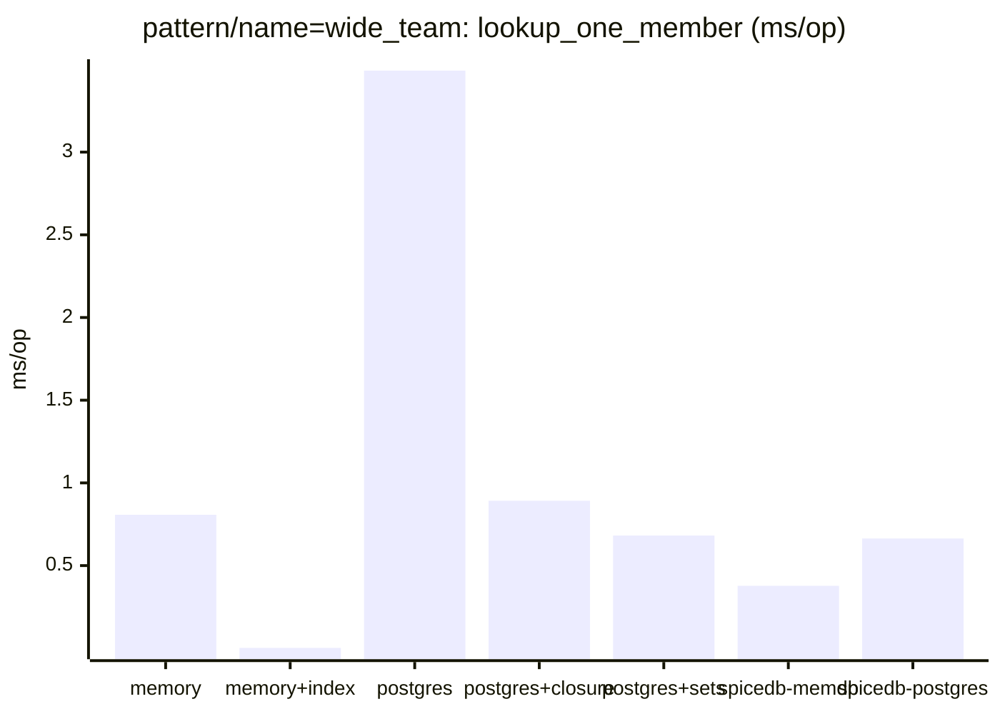
```mermaid
xychart-beta
    title "pattern/name=wide_team: lookup_one_member (ms/op)"
    x-axis ["memory", "memory+index", "postgres", "postgres+closure", "postgres+sets", "spicedb-memdb", "spicedb-postgres"]
    y-axis "ms/op"
    bar [0.807, 0.002, 3.493, 0.892, 0.682, 0.378, 0.664]
```

## pattern/name=deep_nesting

| op | memory | memory+index | postgres | postgres+closure | postgres+sets | spicedb-memdb | spicedb-postgres |
|---|---:|---:|---:|---:|---:|---:|---:|
| check_hit | 187.1 µs | 5.8 µs | 15.6 ms | 1.5 ms | 921.3 µs | | |
| check_miss | 178.9 µs | 6.0 µs | 15.9 ms | 1.8 ms | 824.4 µs | | |
| lookup_all_teams | 6.8 ms | 28.6 µs | 38.7 ms | 1.8 ms | 1.8 ms | | |
| subjects_at_top | 223.9 µs | 7.0 µs | 15.9 ms | 1.6 ms | 768.8 µs | | |
| toggle_top_edge | 17.8 µs (0.02×) | 18.0 µs (0.01×) | 1.8 ms (0.52×) | 41.5 ms (11.8×) | 42.4 ms (12.0×) | 853.9 µs | 3.5 ms |
| toggle_bottom_edge | 18.7 µs (0.02×) | 18.3 µs (0.01×) | 1.9 ms (0.55×) | 6.9 ms (2.05×) | 7.3 ms (2.18×) | 861.1 µs | 3.4 ms |

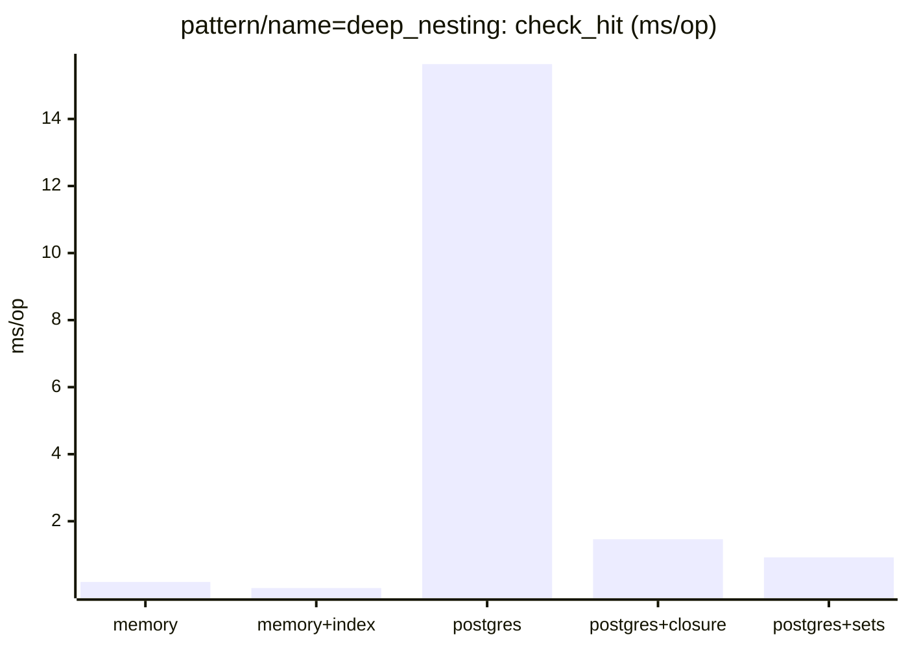
```mermaid
xychart-beta
    title "pattern/name=deep_nesting: check_hit (ms/op)"
    x-axis ["memory", "memory+index", "postgres", "postgres+closure", "postgres+sets"]
    y-axis "ms/op"
    bar [0.187, 0.006, 15.638, 1.462, 0.921]
```

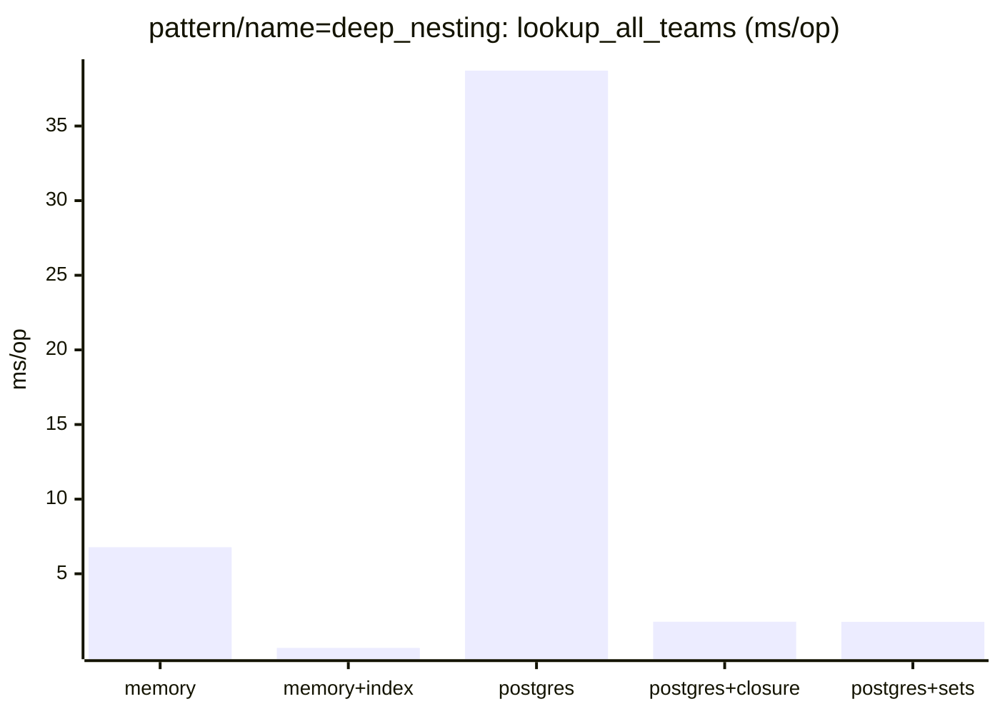
```mermaid
xychart-beta
    title "pattern/name=deep_nesting: lookup_all_teams (ms/op)"
    x-axis ["memory", "memory+index", "postgres", "postgres+closure", "postgres+sets"]
    y-axis "ms/op"
    bar [6.780, 0.029, 38.715, 1.786, 1.779]
```

## pattern/name=hub_user

| op | memory | memory+index | postgres | postgres+closure | postgres+sets | spicedb-memdb | spicedb-postgres |
|---|---:|---:|---:|---:|---:|---:|---:|
| lookup_hub | 883.4 µs (1.28×) | 21.6 µs (0.02×) | 2.1 ms (2.35×) | 988.9 µs (1.09×) | 783.6 µs (0.86×) | 692.7 µs | 909.6 µs |
| lookup_single_owner | 454.2 µs (1.21×) | 2.2 µs (0.00×) | 1.1 ms (1.77×) | 972.8 µs (1.50×) | 687.5 µs (1.06×) | 375.5 µs | 648.8 µs |
| check_miss | 140.5 µs (0.38×) | 2.0 µs (0.00×) | 499.0 µs (0.78×) | 1.0 ms (1.61×) | 820.5 µs (1.29×) | 370.6 µs | 637.7 µs |

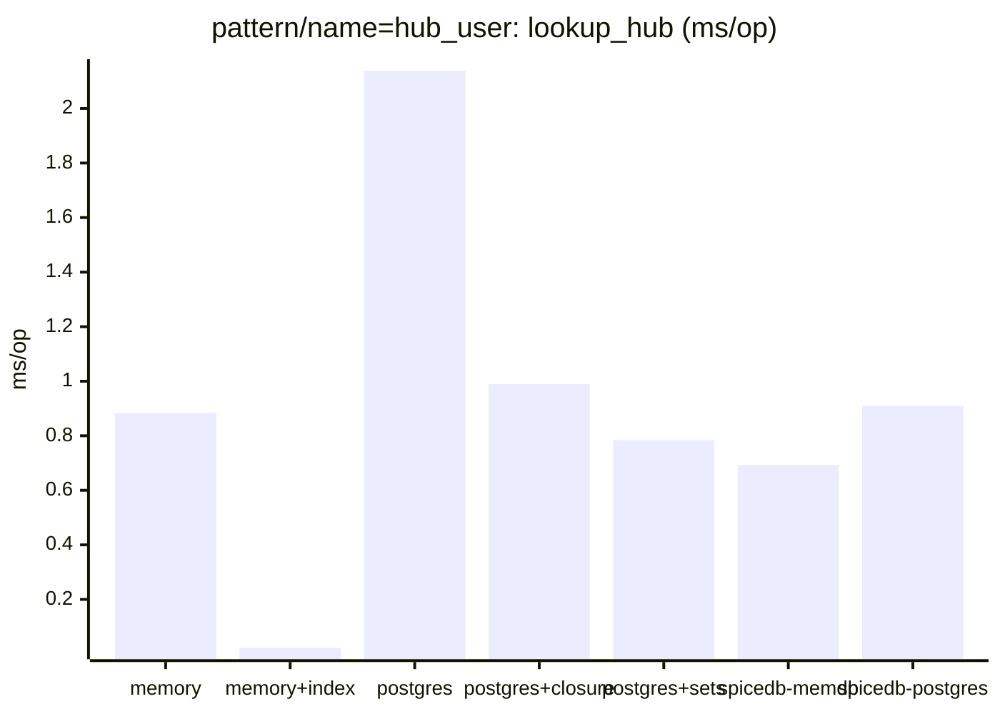
```mermaid
xychart-beta
    title "pattern/name=hub_user: lookup_hub (ms/op)"
    x-axis ["memory", "memory+index", "postgres", "postgres+closure", "postgres+sets", "spicedb-memdb", "spicedb-postgres"]
    y-axis "ms/op"
    bar [0.883, 0.022, 2.139, 0.989, 0.784, 0.693, 0.910]
```

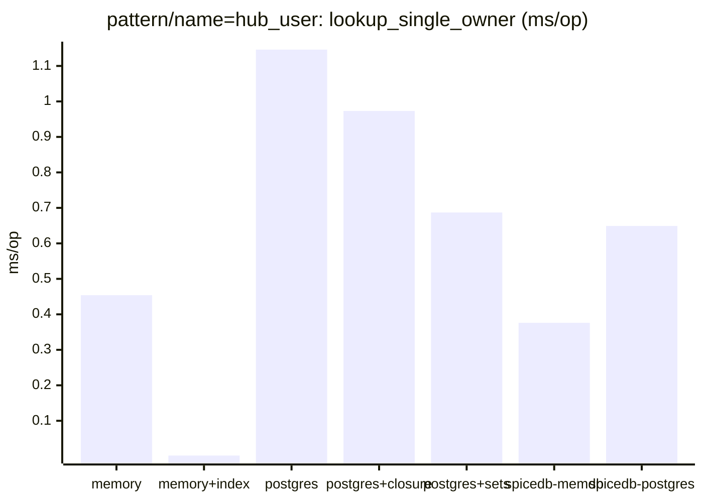
```mermaid
xychart-beta
    title "pattern/name=hub_user: lookup_single_owner (ms/op)"
    x-axis ["memory", "memory+index", "postgres", "postgres+closure", "postgres+sets", "spicedb-memdb", "spicedb-postgres"]
    y-axis "ms/op"
    bar [0.454, 0.002, 1.146, 0.973, 0.687, 0.376, 0.649]
```

## pattern/name=needle

| op | memory | memory+index | postgres | postgres+closure | postgres+sets | spicedb-memdb | spicedb-postgres |
|---|---:|---:|---:|---:|---:|---:|---:|
| lookup_needle | 2.0 ms (5.30×) | 2.3 µs (0.00×) | 1.0 ms (1.60×) | 877.5 µs (1.35×) | 656.5 µs (1.01×) | 376.1 µs | 648.0 µs |
| check_needle | 744.0 µs (2.00×) | 2.1 µs (0.00×) | 471.9 µs (0.75×) | 971.8 µs (1.55×) | 807.8 µs (1.29×) | 371.7 µs | 627.4 µs |
| lookup_nobody | 997.5 µs (2.91×) | 1.8 µs (0.00×) | 622.8 µs (1.02×) | 927.9 µs (1.52×) | 685.0 µs (1.12×) | 343.3 µs | 611.2 µs |

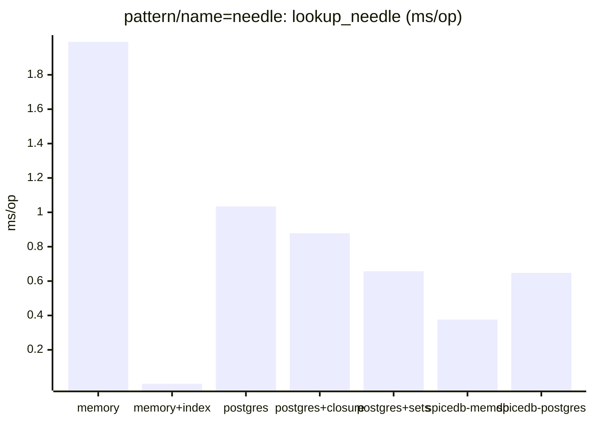
```mermaid
xychart-beta
    title "pattern/name=needle: lookup_needle (ms/op)"
    x-axis ["memory", "memory+index", "postgres", "postgres+closure", "postgres+sets", "spicedb-memdb", "spicedb-postgres"]
    y-axis "ms/op"
    bar [1.992, 0.002, 1.034, 0.878, 0.657, 0.376, 0.648]
```

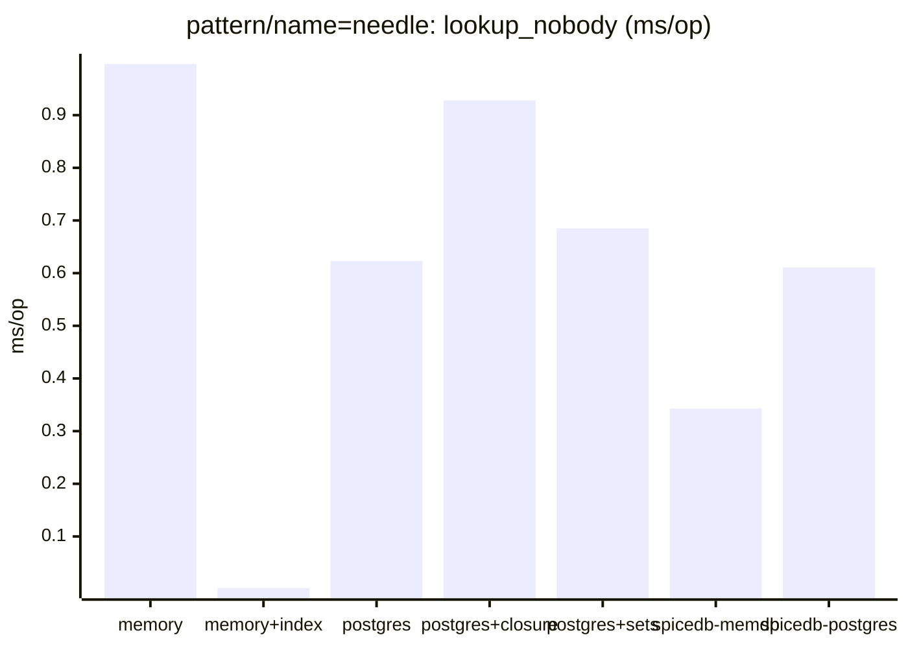
```mermaid
xychart-beta
    title "pattern/name=needle: lookup_nobody (ms/op)"
    x-axis ["memory", "memory+index", "postgres", "postgres+closure", "postgres+sets", "spicedb-memdb", "spicedb-postgres"]
    y-axis "ms/op"
    bar [0.997, 0.002, 0.623, 0.928, 0.685, 0.343, 0.611]
```

## pattern/name=fan_in

| op | memory | memory+index | postgres | postgres+closure | postgres+sets | spicedb-memdb | spicedb-postgres |
|---|---:|---:|---:|---:|---:|---:|---:|
| check_last | 6.7 ms (18.8×) | 23.0 µs (0.04×) | 63.7 ms (101×) | 603.4 µs (0.96×) | 862.2 µs (1.37×) | 355.0 µs | 631.6 µs |
| check_miss | 7.7 ms (21.6×) | 20.4 µs (0.03×) | 73.9 ms (119×) | 948.9 µs (1.53×) | 806.8 µs (1.30×) | 354.5 µs | 622.1 µs |
| subjects_teams | 17.2 ms (5.82×) | 251.8 µs (0.08×) | 79.2 ms (25.5×) | 2.2 ms (0.72×) | 2.2 ms (0.72×) | 3.0 ms | 3.1 ms |
| subjects_users | 16.5 ms (9.77×) | 199.8 µs (0.10×) | 77.2 ms (39.5×) | 2.1 ms (1.10×) | 1.4 ms (0.74×) | 1.7 ms | 2.0 ms |
| lookup_one | 497.2 µs (1.24×) | 2.3 µs (0.00×) | 3.5 ms (5.30×) | 911.7 µs (1.38×) | 670.4 µs (1.02×) | 400.7 µs | 659.1 µs |

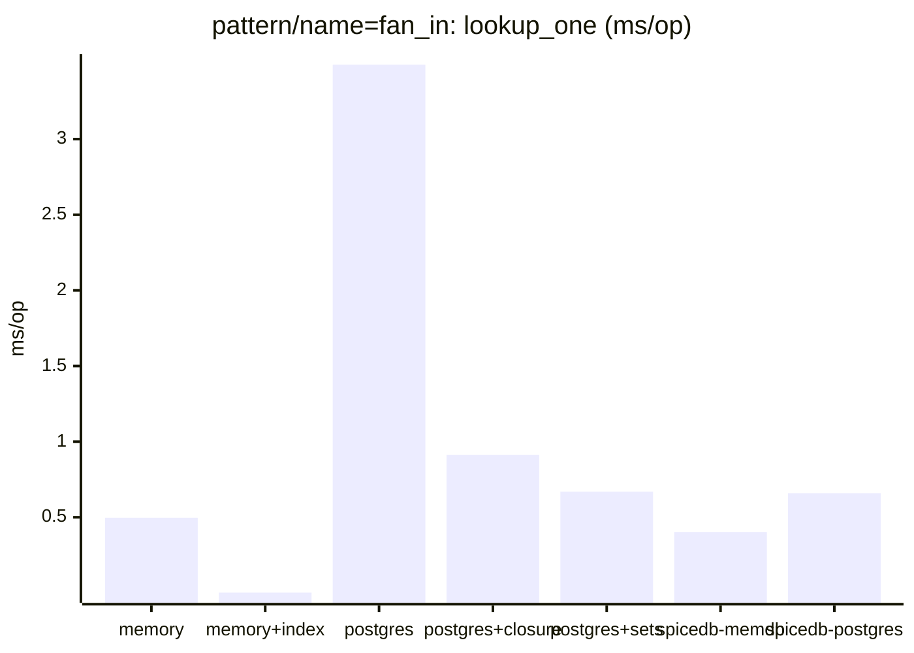
```mermaid
xychart-beta
    title "pattern/name=fan_in: lookup_one (ms/op)"
    x-axis ["memory", "memory+index", "postgres", "postgres+closure", "postgres+sets", "spicedb-memdb", "spicedb-postgres"]
    y-axis "ms/op"
    bar [0.497, 0.002, 3.493, 0.912, 0.670, 0.401, 0.659]
```

## pattern/name=dag

| op | memory | memory+index | postgres | postgres+closure | postgres+sets | spicedb-memdb | spicedb-postgres |
|---|---:|---:|---:|---:|---:|---:|---:|
| check_top | 157.2 µs (0.45×) | 3.0 µs (0.00×) | 1.0 ms (1.65×) | 630.0 µs (1.00×) | 989.0 µs (1.57×) | 351.4 µs | 630.5 µs |
| lookup_all_layers | 5.3 ms (6.87×) | 20.0 µs (0.02×) | 4.4 ms (4.21×) | 641.4 µs (0.61×) | 645.2 µs (0.61×) | 770.4 µs | 1.1 ms |
| toggle_bottom_edge | 185.4 µs (0.22×) | 186.9 µs (0.05×) | 1.8 ms (0.48×) | 6.6 ms (1.75×) | 7.2 ms (1.90×) | 830.3 µs | 3.8 ms |

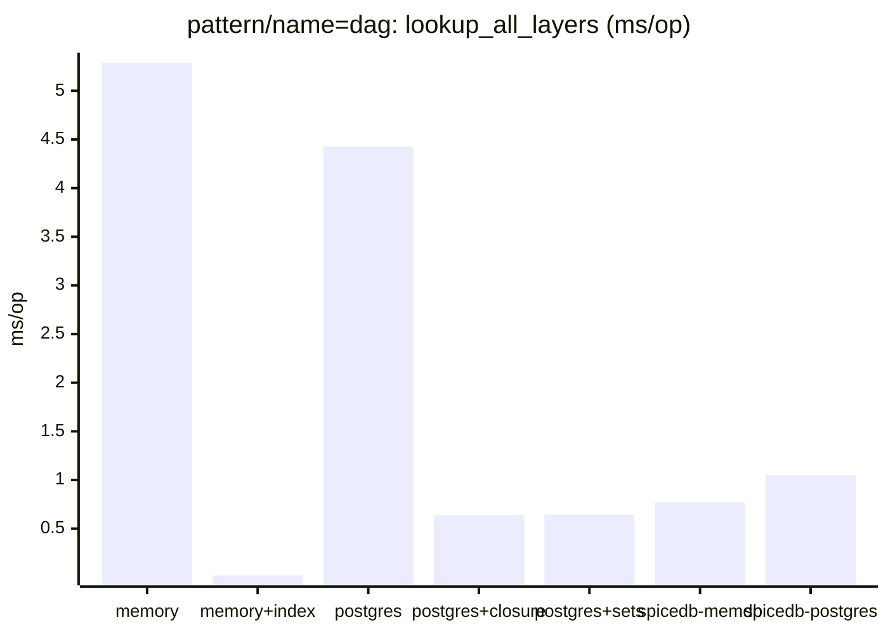
```mermaid
xychart-beta
    title "pattern/name=dag: lookup_all_layers (ms/op)"
    x-axis ["memory", "memory+index", "postgres", "postgres+closure", "postgres+sets", "spicedb-memdb", "spicedb-postgres"]
    y-axis "ms/op"
    bar [5.289, 0.020, 4.426, 0.641, 0.645, 0.770, 1.052]
```

## pattern/name=arrow_chain

| op | memory | memory+index | postgres | postgres+closure | postgres+sets | spicedb-memdb | spicedb-postgres |
|---|---:|---:|---:|---:|---:|---:|---:|
| check_leaf | 63.6 µs (0.17×) | 2.7 µs (0.00×) | 8.5 ms (13.7×) | 15.3 ms (24.7×) | 842.0 µs (1.36×) | 381.4 µs | 620.1 µs |
| check_miss | 63.0 µs (0.18×) | 3.9 µs (0.01×) | 8.6 ms (13.3×) | 15.6 ms (24.4×) | 815.7 µs (1.27×) | 356.0 µs | 640.8 µs |
| lookup_all_folders | 485.6 µs (0.69×) | 10.6 µs (0.01×) | 8.6 ms (8.66×) | 14.4 ms (14.5×) | 914.3 µs (0.92×) | 700.7 µs | 990.6 µs |
| subjects_leaf | 81.7 µs (0.22×) | 4.2 µs (0.01×) | 8.0 ms (12.7×) | 15.4 ms (24.3×) | 772.4 µs (1.22×) | 364.1 µs | 632.9 µs |

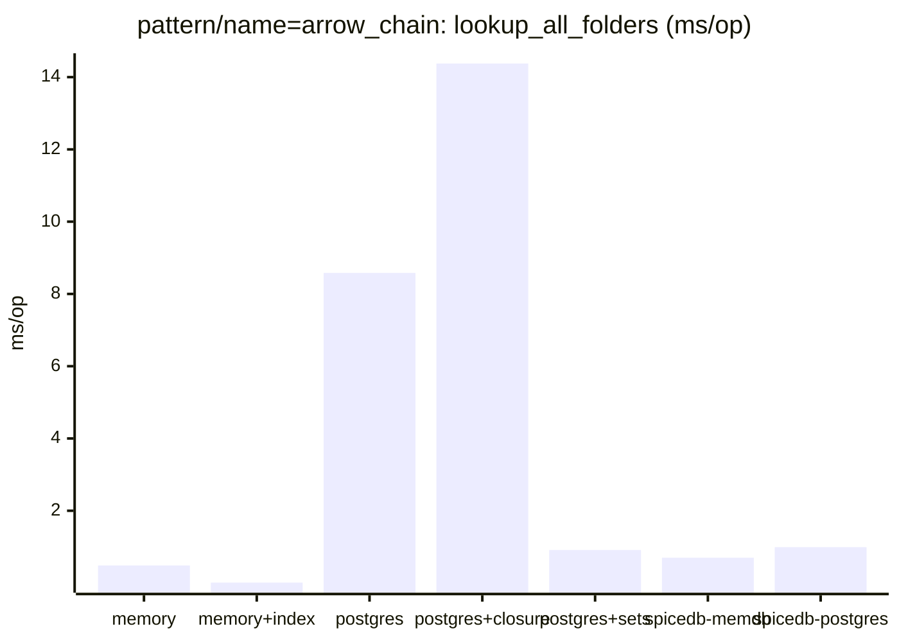
```mermaid
xychart-beta
    title "pattern/name=arrow_chain: lookup_all_folders (ms/op)"
    x-axis ["memory", "memory+index", "postgres", "postgres+closure", "postgres+sets", "spicedb-memdb", "spicedb-postgres"]
    y-axis "ms/op"
    bar [0.486, 0.011, 8.581, 14.378, 0.914, 0.701, 0.991]
```

## pattern/name=wildcard_ban

| op | memory | memory+index | postgres | postgres+closure | postgres+sets | spicedb-memdb | spicedb-postgres |
|---|---:|---:|---:|---:|---:|---:|---:|
| check_unbanned | 8.3 ms (22.3×) | 36.3 µs (0.06×) | 3.7 ms (5.86×) | 1.0 ms (1.61×) | 1.0 ms (1.63×) | 373.2 µs | 624.9 µs |
| check_banned | 8.3 ms (23.8×) | 33.8 µs (0.05×) | 3.4 ms (5.41×) | 1.0 ms (1.58×) | 1.0 ms (1.61×) | 349.4 µs | 636.8 µs |
| subjects_wildcard_minus | 9.7 ms (3.00×) | 2.4 ms (0.68×) | 4.9 ms (1.40×) | 17.2 ms (4.87×) | 17.2 ms (4.86×) | 3.2 ms | 3.5 ms |
| lookup_banned | 239.7 µs (0.69×) | 2.8 µs (0.00×) | 638.8 µs (1.03×) | 875.6 µs (1.41×) | 944.8 µs (1.52×) | 346.0 µs | 621.0 µs |
| lookup_unbanned | 230.1 µs (0.62×) | 2.8 µs (0.00×) | 597.4 µs (0.93×) | 841.0 µs (1.31×) | 872.1 µs (1.36×) | 372.0 µs | 639.6 µs |

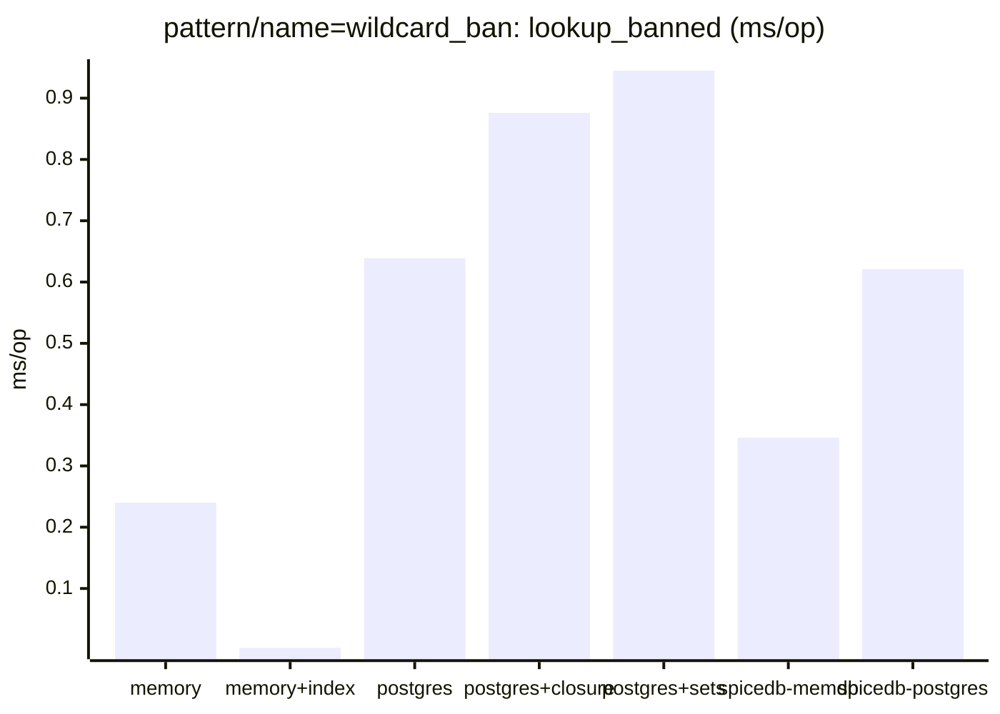
```mermaid
xychart-beta
    title "pattern/name=wildcard_ban: lookup_banned (ms/op)"
    x-axis ["memory", "memory+index", "postgres", "postgres+closure", "postgres+sets", "spicedb-memdb", "spicedb-postgres"]
    y-axis "ms/op"
    bar [0.240, 0.003, 0.639, 0.876, 0.945, 0.346, 0.621]
```

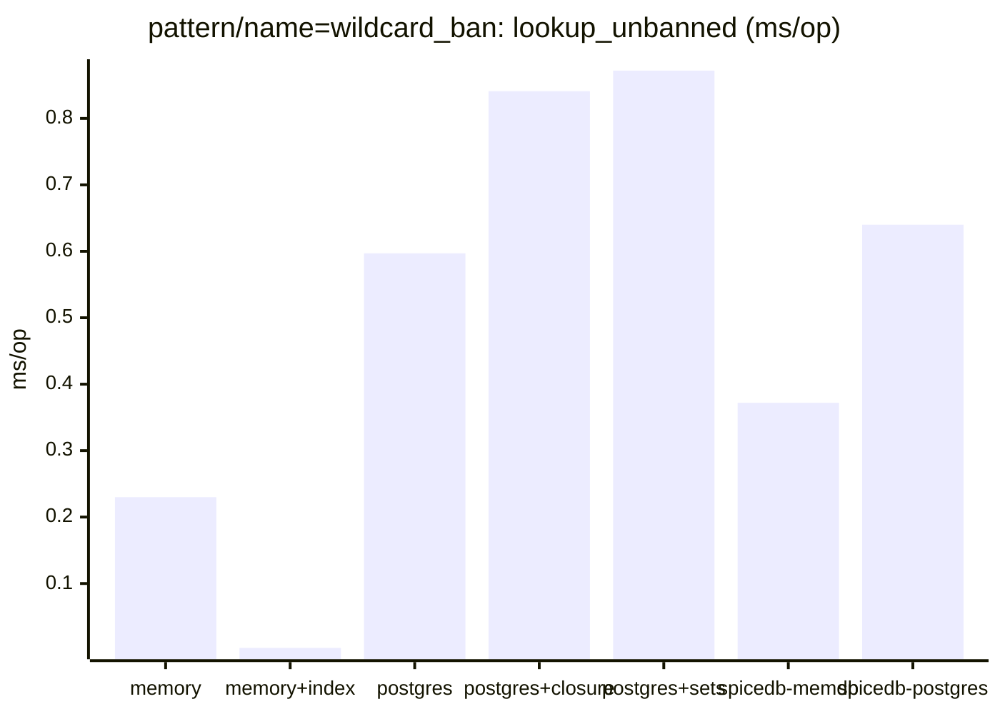
```mermaid
xychart-beta
    title "pattern/name=wildcard_ban: lookup_unbanned (ms/op)"
    x-axis ["memory", "memory+index", "postgres", "postgres+closure", "postgres+sets", "spicedb-memdb", "spicedb-postgres"]
    y-axis "ms/op"
    bar [0.230, 0.003, 0.597, 0.841, 0.872, 0.372, 0.640]
```

## scale/resources=1000/density=10/path=direct

| op | memory | memory+index | postgres | postgres+closure | postgres+sets | spicedb-memdb | spicedb-postgres |
|---|---:|---:|---:|---:|---:|---:|---:|
| lookup | 902.8 µs (0.92×) | 43.9 µs (0.04×) | 2.2 ms (1.78×) | 1.2 ms (0.94×) | 918.4 µs (0.74×) | 981.0 µs | 1.2 ms |
| check_hit | 41.6 µs (0.12×) | 2.0 µs (0.00×) | 319.0 µs (0.51×) | 687.2 µs (1.10×) | 1.1 ms (1.68×) | 352.3 µs | 627.6 µs |
| check_miss | 78.3 µs (0.22×) | 2.0 µs (0.00×) | 450.4 µs (0.71×) | 1.1 ms (1.69×) | 1.1 ms (1.70×) | 348.8 µs | 635.1 µs |
| bulk_100 | 1.0 ms (0.75×) | 209.8 µs (0.13×) | 2.0 ms (1.18×) | 3.3 ms (2.02×) | 2.5 ms (1.51×) | 1.4 ms | 1.7 ms |
| subjects_one | 81.4 µs (0.22×) | 2.5 µs (0.00×) | 440.8 µs (0.69×) | 1.0 ms (1.63×) | 636.2 µs (0.99×) | 377.4 µs | 643.2 µs |
| toggle_grant | 404.7 µs (0.48×) | 416.5 µs (0.12×) | 1.7 ms (0.49×) | 1.8 ms (0.50×) | 3.5 ms (0.99×) | 841.9 µs | 3.6 ms |

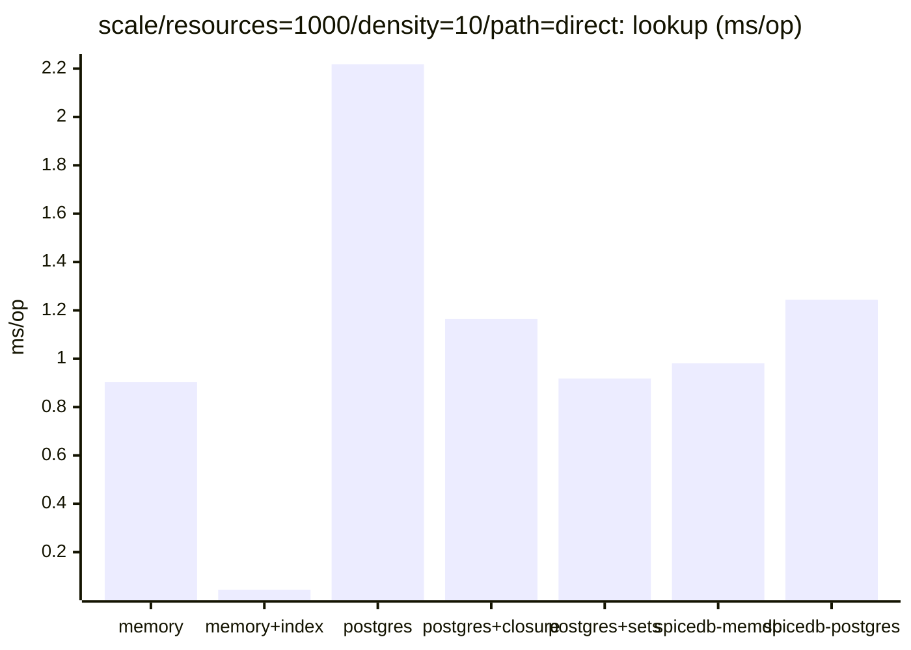
```mermaid
xychart-beta
    title "scale/resources=1000/density=10/path=direct: lookup (ms/op)"
    x-axis ["memory", "memory+index", "postgres", "postgres+closure", "postgres+sets", "spicedb-memdb", "spicedb-postgres"]
    y-axis "ms/op"
    bar [0.903, 0.044, 2.218, 1.164, 0.918, 0.981, 1.244]
```

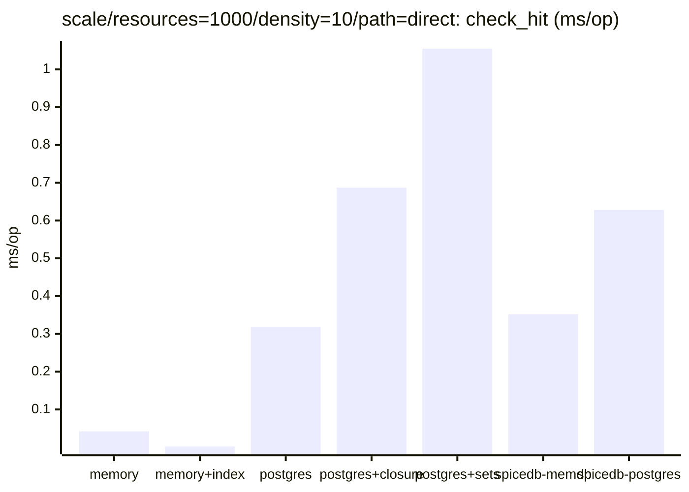
```mermaid
xychart-beta
    title "scale/resources=1000/density=10/path=direct: check_hit (ms/op)"
    x-axis ["memory", "memory+index", "postgres", "postgres+closure", "postgres+sets", "spicedb-memdb", "spicedb-postgres"]
    y-axis "ms/op"
    bar [0.042, 0.002, 0.319, 0.687, 1.055, 0.352, 0.628]
```

## scale/resources=1000/density=90/path=direct

| op | memory | memory+index | postgres | postgres+closure | postgres+sets | spicedb-memdb | spicedb-postgres |
|---|---:|---:|---:|---:|---:|---:|---:|
| lookup | 6.0 ms (1.14×) | 530.2 µs (0.10×) | 5.8 ms (1.08×) | 2.0 ms (0.36×) | 1.9 ms (0.34×) | 5.3 ms | 5.4 ms |
| check_hit | 61.6 µs (0.16×) | 2.0 µs (0.00×) | 336.1 µs (0.53×) | 641.9 µs (1.01×) | 1.0 ms (1.60×) | 383.0 µs | 633.9 µs |
| check_miss | 119.7 µs (0.34×) | 2.1 µs (0.00×) | 466.0 µs (0.74×) | 1.1 ms (1.67×) | 1.0 ms (1.59×) | 353.6 µs | 632.9 µs |
| bulk_100 | 1.2 ms (0.93×) | 601.7 µs (0.35×) | 1.9 ms (1.10×) | 3.3 ms (1.95×) | 3.1 ms (1.79×) | 1.3 ms | 1.7 ms |
| subjects_one | 122.4 µs (0.31×) | 2.5 µs (0.00×) | 440.9 µs (0.67×) | 1.0 ms (1.56×) | 621.7 µs (0.95×) | 397.0 µs | 654.4 µs |
| toggle_grant | 742.5 µs (0.82×) | 736.5 µs (0.21×) | 1.8 ms (0.51×) | 1.9 ms (0.53×) | 3.7 ms (1.06×) | 910.3 µs | 3.5 ms |

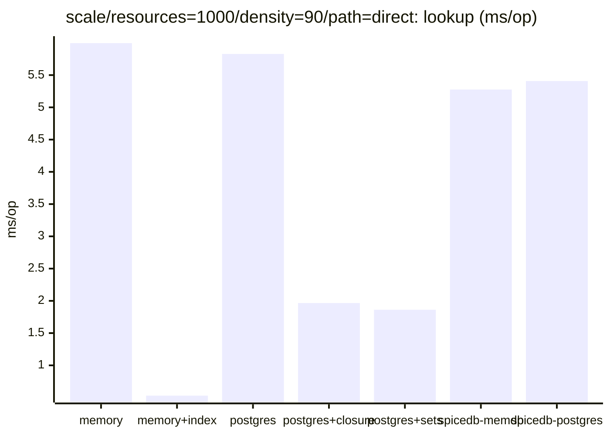
```mermaid
xychart-beta
    title "scale/resources=1000/density=90/path=direct: lookup (ms/op)"
    x-axis ["memory", "memory+index", "postgres", "postgres+closure", "postgres+sets", "spicedb-memdb", "spicedb-postgres"]
    y-axis "ms/op"
    bar [5.996, 0.530, 5.828, 1.966, 1.862, 5.276, 5.408]
```

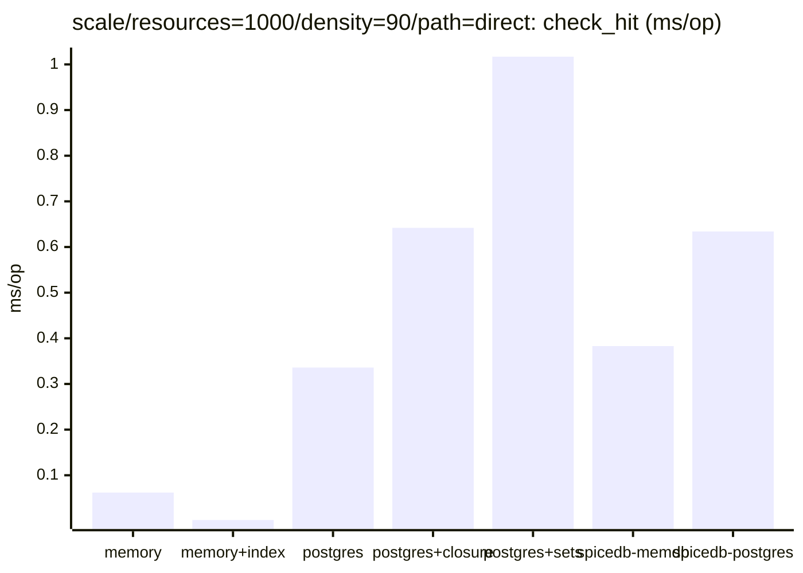
```mermaid
xychart-beta
    title "scale/resources=1000/density=90/path=direct: check_hit (ms/op)"
    x-axis ["memory", "memory+index", "postgres", "postgres+closure", "postgres+sets", "spicedb-memdb", "spicedb-postgres"]
    y-axis "ms/op"
    bar [0.062, 0.002, 0.336, 0.642, 1.017, 0.383, 0.634]
```

## scale/resources=1000/density=10/path=team

| op | memory | memory+index | postgres | postgres+closure | postgres+sets | spicedb-memdb | spicedb-postgres |
|---|---:|---:|---:|---:|---:|---:|---:|
| lookup | 1.6 ms (1.55×) | 44.5 µs (0.04×) | 4.2 ms (3.35×) | 1.0 ms (0.84×) | 852.4 µs (0.68×) | 1.0 ms | 1.2 ms |
| check_hit | 72.8 µs (0.21×) | 2.1 µs (0.00×) | 463.0 µs (0.73×) | 644.8 µs (1.01×) | 909.3 µs (1.43×) | 352.4 µs | 637.8 µs |
| check_miss | 79.6 µs (0.23×) | 2.1 µs (0.00×) | 472.6 µs (0.75×) | 1.1 ms (1.67×) | 927.4 µs (1.46×) | 349.9 µs | 633.5 µs |
| bulk_100 | 1.1 ms (0.77×) | 214.5 µs (0.13×) | 2.1 ms (1.20×) | 3.0 ms (1.73×) | 2.2 ms (1.30×) | 1.4 ms | 1.7 ms |
| subjects_one | 82.2 µs (0.22×) | 2.6 µs (0.00×) | 465.5 µs (0.73×) | 1.0 ms (1.57×) | 662.1 µs (1.04×) | 376.7 µs | 638.1 µs |
| toggle_team_edge | 403.8 µs (0.47×) | 424.6 µs (0.11×) | 1.9 ms (0.50×) | 4.3 ms (1.16×) | 5.8 ms (1.57×) | 858.4 µs | 3.7 ms |

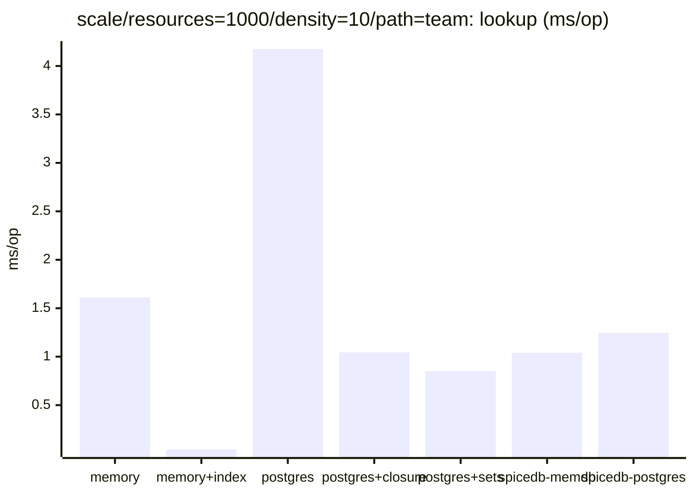
```mermaid
xychart-beta
    title "scale/resources=1000/density=10/path=team: lookup (ms/op)"
    x-axis ["memory", "memory+index", "postgres", "postgres+closure", "postgres+sets", "spicedb-memdb", "spicedb-postgres"]
    y-axis "ms/op"
    bar [1.612, 0.045, 4.176, 1.046, 0.852, 1.041, 1.246]
```

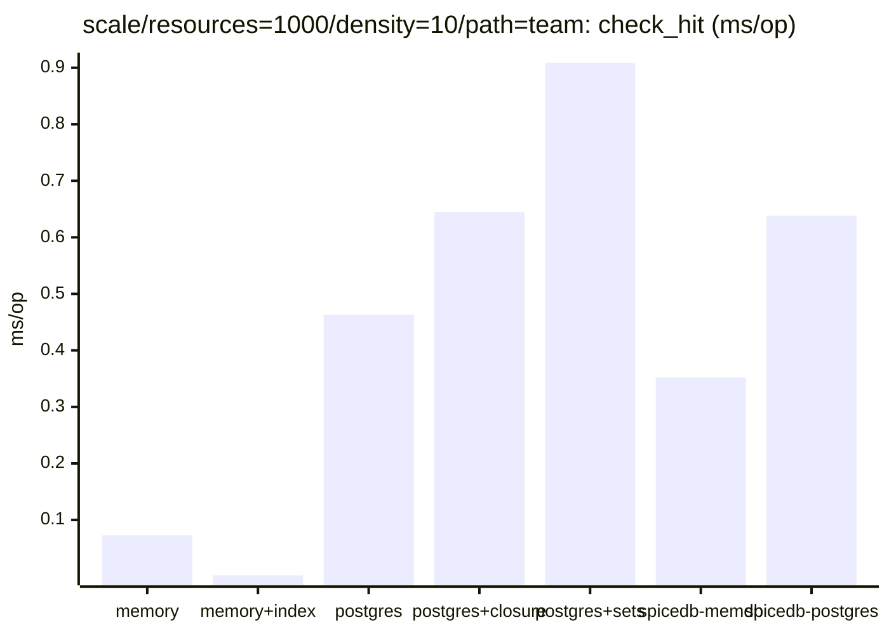
```mermaid
xychart-beta
    title "scale/resources=1000/density=10/path=team: check_hit (ms/op)"
    x-axis ["memory", "memory+index", "postgres", "postgres+closure", "postgres+sets", "spicedb-memdb", "spicedb-postgres"]
    y-axis "ms/op"
    bar [0.073, 0.002, 0.463, 0.645, 0.909, 0.352, 0.638]
```

## scale/resources=10000/density=10/path=direct

| op | memory | memory+index | postgres | postgres+closure | postgres+sets | spicedb-memdb | spicedb-postgres |
|---|---:|---:|---:|---:|---:|---:|---:|
| lookup | 12.4 ms (1.96×) | 578.8 µs (0.09×) | 7.4 ms (1.20×) | 2.2 ms (0.35×) | 2.1 ms (0.35×) | 6.3 ms | 6.1 ms |
| check_hit | 496.4 µs (1.41×) | 2.0 µs (0.00×) | 330.7 µs (0.52×) | 614.6 µs (0.97×) | 798.4 µs (1.26×) | 352.6 µs | 633.9 µs |
| check_miss | 972.2 µs (2.74×) | 2.0 µs (0.00×) | 453.0 µs (0.71×) | 1.0 ms (1.60×) | 806.7 µs (1.26×) | 354.2 µs | 638.3 µs |
| bulk_100 | 3.6 ms (2.81×) | 584.7 µs (0.35×) | 1.6 ms (0.97×) | 3.0 ms (1.78×) | 3.0 ms (1.80×) | 1.3 ms | 1.7 ms |
| subjects_one | 983.4 µs (2.63×) | 2.5 µs (0.00×) | 455.9 µs (0.70×) | 937.3 µs (1.44×) | 679.4 µs (1.04×) | 373.7 µs | 652.6 µs |
| toggle_grant | 9.9 ms (11.1×) | 9.6 ms (2.77×) | 1.8 ms (0.52×) | 1.9 ms (0.54×) | 3.1 ms (0.89×) | 896.2 µs | 3.5 ms |

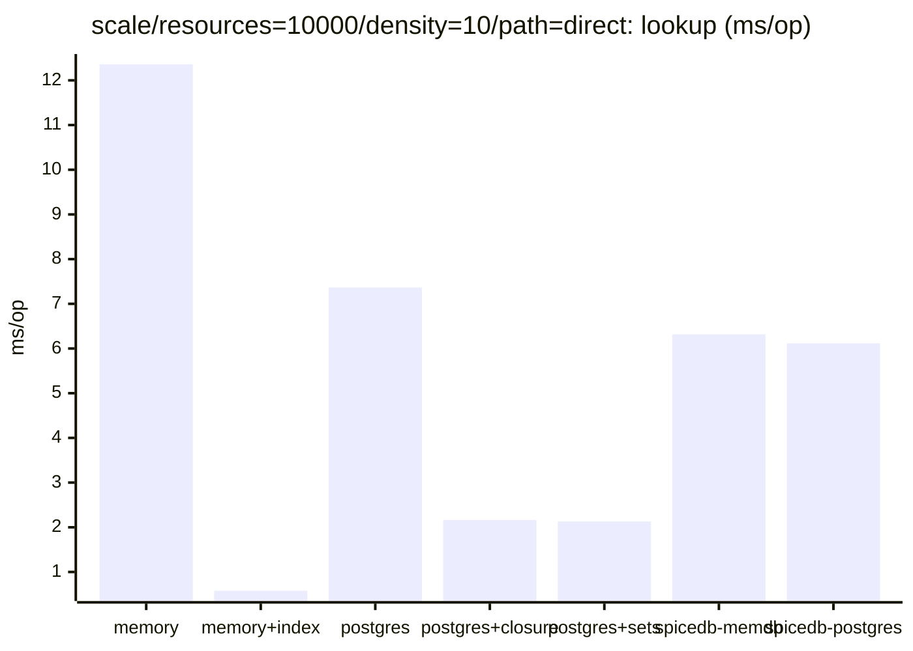
```mermaid
xychart-beta
    title "scale/resources=10000/density=10/path=direct: lookup (ms/op)"
    x-axis ["memory", "memory+index", "postgres", "postgres+closure", "postgres+sets", "spicedb-memdb", "spicedb-postgres"]
    y-axis "ms/op"
    bar [12.358, 0.579, 7.365, 2.163, 2.131, 6.317, 6.116]
```

```mermaid
xychart-beta
    title "scale/resources=10000/density=10/path=direct: check_hit (ms/op)"
    x-axis ["memory", "memory+index", "postgres", "postgres+closure", "postgres+sets", "spicedb-memdb", "spicedb-postgres"]
    y-axis "ms/op"
    bar [0.496, 0.002, 0.331, 0.615, 0.798, 0.353, 0.634]
```

## scale/resources=10000/density=90/path=direct

| op | memory | memory+index | postgres | postgres+closure | postgres+sets | spicedb-memdb | spicedb-postgres |
|---|---:|---:|---:|---:|---:|---:|---:|
| lookup | 76.1 ms (1.40×) | 5.3 ms (0.12×) | 38.6 ms (0.84×) | 8.9 ms (0.19×) | 11.3 ms (0.25×) | 54.5 ms | 45.9 ms |
| check_hit | 565.4 µs (1.58×) | 2.0 µs (0.00×) | 317.0 µs (0.50×) | 614.0 µs (0.97×) | 813.3 µs (1.29×) | 358.2 µs | 629.9 µs |
| check_miss | 1.1 ms (3.18×) | 2.0 µs (0.00×) | 474.2 µs (0.75×) | 1.0 ms (1.65×) | 803.5 µs (1.27×) | 356.6 µs | 631.2 µs |
| bulk_100 | 3.5 ms (2.60×) | 3.8 ms (2.27×) | 1.7 ms (1.00×) | 3.0 ms (1.83×) | 7.4 ms (4.43×) | 1.4 ms | 1.7 ms |
| subjects_one | 1.1 ms (2.99×) | 2.5 µs (0.00×) | 483.0 µs (0.75×) | 948.0 µs (1.48×) | 638.8 µs (1.00×) | 374.4 µs | 641.9 µs |
| toggle_grant | 10.7 ms (11.9×) | 11.4 ms (3.26×) | 1.8 ms (0.51×) | 1.8 ms (0.52×) | 2.9 ms (0.84×) | 899.2 µs | 3.5 ms |

```mermaid
xychart-beta
    title "scale/resources=10000/density=90/path=direct: lookup (ms/op)"
    x-axis ["memory", "memory+index", "postgres", "postgres+closure", "postgres+sets", "spicedb-memdb", "spicedb-postgres"]
    y-axis "ms/op"
    bar [76.064, 5.289, 38.571, 8.888, 11.283, 54.516, 45.902]
```

```mermaid
xychart-beta
    title "scale/resources=10000/density=90/path=direct: check_hit (ms/op)"
    x-axis ["memory", "memory+index", "postgres", "postgres+closure", "postgres+sets", "spicedb-memdb", "spicedb-postgres"]
    y-axis "ms/op"
    bar [0.565, 0.002, 0.317, 0.614, 0.813, 0.358, 0.630]
```

## scale/resources=10000/density=10/path=team

| op | memory | memory+index | postgres | postgres+closure | postgres+sets | spicedb-memdb | spicedb-postgres |
|---|---:|---:|---:|---:|---:|---:|---:|
| lookup | 21.5 ms (3.63×) | 565.9 µs (0.09×) | 8.4 ms (1.30×) | 2.2 ms (0.35×) | 2.0 ms (0.32×) | 5.9 ms | 6.5 ms |
| check_hit | 926.7 µs (2.61×) | 2.1 µs (0.00×) | 486.1 µs (0.77×) | 637.9 µs (1.02×) | 1.2 ms (1.97×) | 355.7 µs | 627.9 µs |
| check_miss | 984.9 µs (2.77×) | 2.0 µs (0.00×) | 453.4 µs (0.72×) | 1.0 ms (1.64×) | 1.2 ms (1.99×) | 355.9 µs | 626.0 µs |
| bulk_100 | 4.0 ms (2.34×) | 571.9 µs (0.36×) | 1.8 ms (1.10×) | 2.9 ms (1.83×) | 2.9 ms (1.82×) | 1.7 ms | 1.6 ms |
| subjects_one | 987.6 µs (2.64×) | 2.4 µs (0.00×) | 478.9 µs (0.74×) | 935.2 µs (1.45×) | 737.8 µs (1.14×) | 374.7 µs | 646.4 µs |
| toggle_team_edge | 9.8 ms (11.5×) | 9.7 ms (2.84×) | 1.8 ms (0.53×) | 11.2 ms (3.29×) | 12.1 ms (3.54×) | 855.4 µs | 3.4 ms |

```mermaid
xychart-beta
    title "scale/resources=10000/density=10/path=team: lookup (ms/op)"
    x-axis ["memory", "memory+index", "postgres", "postgres+closure", "postgres+sets", "spicedb-memdb", "spicedb-postgres"]
    y-axis "ms/op"
    bar [21.483, 0.566, 8.381, 2.228, 2.047, 5.915, 6.452]
```

```mermaid
xychart-beta
    title "scale/resources=10000/density=10/path=team: check_hit (ms/op)"
    x-axis ["memory", "memory+index", "postgres", "postgres+closure", "postgres+sets", "spicedb-memdb", "spicedb-postgres"]
    y-axis "ms/op"
    bar [0.927, 0.002, 0.486, 0.638, 1.234, 0.356, 0.628]
```

## scale/resources=100000/density=10/path=direct

| op | memory | memory+index | postgres | postgres+closure | postgres+sets | spicedb-memdb | spicedb-postgres |
|---|---:|---:|---:|---:|---:|---:|---:|
| lookup | 150.3 ms (2.37×) | 1.55 s (30.1×) | 49.7 ms (0.96×) | 11.6 ms (0.23×) | 13.8 ms (0.27×) | 63.5 ms | 51.5 ms |
| check_hit | 4.6 ms (12.2×) | 1.9 µs (0.00×) | 327.4 µs (0.52×) | 625.6 µs (0.98×) | 801.7 µs (1.26×) | 379.7 µs | 635.2 µs |
| check_miss | 9.3 ms (26.5×) | 1.9 µs (0.00×) | 450.8 µs (0.71×) | 1.0 ms (1.62×) | 817.2 µs (1.29×) | 352.7 µs | 632.4 µs |
| bulk_100 | 29.6 ms (22.3×) | 4.6 ms (2.74×) | 1.6 ms (0.97×) | 3.4 ms (1.98×) | 11.2 ms (6.62×) | 1.3 ms | 1.7 ms |
| subjects_one | 9.2 ms (24.8×) | 2.6 µs (0.00×) | 472.3 µs (0.72×) | 986.1 µs (1.51×) | 629.4 µs (0.97×) | 373.3 µs | 651.8 µs |
| toggle_grant | 125.3 ms (148×) | 152.9 ms (26.7×) | 1.8 ms (0.32×) | 1.9 ms (0.32×) | 3.1 ms (0.55×) | 844.4 µs | 5.7 ms |

```mermaid
xychart-beta
    title "scale/resources=100000/density=10/path=direct: lookup (ms/op)"
    x-axis ["memory", "memory+index", "postgres", "postgres+closure", "postgres+sets", "spicedb-memdb", "spicedb-postgres"]
    y-axis "ms/op"
    bar [150.255, 1553.067, 49.653, 11.622, 13.830, 63.466, 51.528]
```

```mermaid
xychart-beta
    title "scale/resources=100000/density=10/path=direct: check_hit (ms/op)"
    x-axis ["memory", "memory+index", "postgres", "postgres+closure", "postgres+sets", "spicedb-memdb", "spicedb-postgres"]
    y-axis "ms/op"
    bar [4.636, 0.002, 0.327, 0.626, 0.802, 0.380, 0.635]
```

## scale/resources=100000/density=90/path=direct

| op | memory | memory+index | postgres | postgres+closure | postgres+sets | spicedb-memdb | spicedb-postgres |
|---|---:|---:|---:|---:|---:|---:|---:|
| lookup | 1.08 s (1.51×) | 1.90 s (2.50×) | 401.9 ms (0.53×) | 100.7 ms (0.13×) | 173.7 ms (0.23×) | 714.9 ms | 761.1 ms |
| check_hit | 5.3 ms (15.0×) | 1.9 µs (0.00×) | 312.6 µs (0.49×) | 622.2 µs (0.97×) | 804.4 µs (1.26×) | 352.2 µs | 640.6 µs |
| check_miss | 10.8 ms (30.7×) | 1.9 µs (0.00×) | 463.7 µs (0.72×) | 1.0 ms (1.56×) | 806.9 µs (1.25×) | 350.8 µs | 644.6 µs |
| bulk_100 | 28.4 ms (21.0×) | 39.5 ms (23.8×) | 1.7 ms (1.04×) | 3.3 ms (1.97×) | 3.9 ms (2.37×) | 1.4 ms | 1.7 ms |
| subjects_one | 10.9 ms (27.9×) | 2.3 µs (0.00×) | 450.6 µs (0.70×) | 987.1 µs (1.52×) | 621.8 µs (0.96×) | 389.9 µs | 648.3 µs |
| toggle_grant | 154.1 ms (180×) | 156.5 ms (44.2×) | 1.9 ms (0.54×) | 1.8 ms (0.51×) | 2.9 ms (0.83×) | 854.4 µs | 3.5 ms |

```mermaid
xychart-beta
    title "scale/resources=100000/density=90/path=direct: lookup (ms/op)"
    x-axis ["memory", "memory+index", "postgres", "postgres+closure", "postgres+sets", "spicedb-memdb", "spicedb-postgres"]
    y-axis "ms/op"
    bar [1080.988, 1902.963, 401.919, 100.744, 173.676, 714.920, 761.114]
```

```mermaid
xychart-beta
    title "scale/resources=100000/density=90/path=direct: check_hit (ms/op)"
    x-axis ["memory", "memory+index", "postgres", "postgres+closure", "postgres+sets", "spicedb-memdb", "spicedb-postgres"]
    y-axis "ms/op"
    bar [5.279, 0.002, 0.313, 0.622, 0.804, 0.352, 0.641]
```

## scale/resources=100000/density=10/path=team

| op | memory | memory+index | postgres | postgres+closure | postgres+sets | spicedb-memdb | spicedb-postgres |
|---|---:|---:|---:|---:|---:|---:|---:|
| lookup | 257.2 ms (4.93×) | 1.65 s (28.7×) | 51.1 ms (0.89×) | 10.7 ms (0.19×) | 13.4 ms (0.23×) | 52.2 ms | 57.6 ms |
| check_hit | 8.7 ms (24.4×) | 2.0 µs (0.00×) | 480.5 µs (0.76×) | 611.3 µs (0.97×) | 824.1 µs (1.31×) | 355.1 µs | 631.4 µs |
| check_miss | 9.2 ms (26.0×) | 2.0 µs (0.00×) | 459.5 µs (0.74×) | 988.5 µs (1.59×) | 839.4 µs (1.35×) | 355.7 µs | 621.1 µs |
| bulk_100 | 35.4 ms (27.6×) | 4.5 ms (2.66×) | 1.8 ms (1.07×) | 4.8 ms (2.81×) | 9.2 ms (5.42×) | 1.3 ms | 1.7 ms |
| subjects_one | 9.3 ms (24.6×) | 2.4 µs (0.00×) | 447.7 µs (0.69×) | 974.1 µs (1.50×) | 637.7 µs (0.98×) | 378.3 µs | 649.5 µs |
| toggle_team_edge | 133.5 ms (159×) | 136.2 ms (38.8×) | 1.9 ms (0.54×) | 82.6 ms (23.5×) | 83.4 ms (23.8×) | 837.6 µs | 3.5 ms |

```mermaid
xychart-beta
    title "scale/resources=100000/density=10/path=team: lookup (ms/op)"
    x-axis ["memory", "memory+index", "postgres", "postgres+closure", "postgres+sets", "spicedb-memdb", "spicedb-postgres"]
    y-axis "ms/op"
    bar [257.194, 1652.320, 51.111, 10.712, 13.377, 52.183, 57.593]
```

```mermaid
xychart-beta
    title "scale/resources=100000/density=10/path=team: check_hit (ms/op)"
    x-axis ["memory", "memory+index", "postgres", "postgres+closure", "postgres+sets", "spicedb-memdb", "spicedb-postgres"]
    y-axis "ms/op"
    bar [8.668, 0.002, 0.480, 0.611, 0.824, 0.355, 0.631]
```

