# Engine comparison

Time per operation; lower is better. Every kind answered the same questions with the same results before being timed. A ratio in parentheses is our time divided by the like-for-like SpiceDB time: memory against spicedb-memdb, the postgres kinds against spicedb-postgres (or spicedb-memdb when that is the only one). Below 1× we are faster. An empty cell is an answer that kind cannot give.

## Summary: geometric mean of our time ÷ SpiceDB time

| scenario | memory vs spicedb-memdb | memory+index vs spicedb-postgres | postgres vs spicedb-postgres | postgres+closure vs spicedb-postgres | postgres+sets vs spicedb-postgres |
|---|---:|---:|---:|---:|---:|
| **all scenarios** | **2.05×** (85 ops) | **0.03×** (85 ops) | **1.45×** (85 ops) | **1.36×** (85 ops) | **1.25×** (85 ops) |
| pattern/name=wide_team | 2.01× | 0.02× | 2.87× | 1.74× | 1.87× |
| pattern/name=deep_nesting | 0.02× | 0.00× | 0.82× | 3.10× | 1.97× |
| pattern/name=hub_user | 0.87× | 0.01× | 1.38× | 1.27× | 0.92× |
| pattern/name=needle | 3.63× | 0.00× | 1.09× | 1.38× | 1.08× |
| pattern/name=fan_in | 8.68× | 0.03× | 37.7× | 1.14× | 1.00× |
| pattern/name=dag | 0.89× | 0.01× | 1.22× | 0.76× | 0.79× |
| pattern/name=arrow_chain | 0.29× | 0.01× | 11.8× | 20.2× | 1.13× |
| pattern/name=wildcard_ban | 3.55× | 0.04× | 2.06× | 1.88× | 1.86× |
| scale/resources=1000/density=10/path=direct | 0.38× | 0.01× | 0.79× | 1.09× | 1.25× |
| scale/resources=1000/density=90/path=direct | 0.54× | 0.02× | 1.06× | 1.08× | 1.12× |
| scale/resources=1000/density=10/path=team | 0.46× | 0.01× | 0.91× | 1.08× | 1.11× |
| scale/resources=10000/density=10/path=direct | 3.31× | 0.03× | 0.85× | 0.97× | 0.98× |
| scale/resources=10000/density=90/path=direct | 3.48× | 0.04× | 0.86× | 0.94× | 1.22× |
| scale/resources=10000/density=10/path=team | 3.98× | 0.03× | 0.86× | 1.20× | 1.22× |
| scale/resources=100000/density=10/path=direct | 8.95× | 0.20× | 0.88× | 1.06× | 1.42× |
| scale/resources=100000/density=90/path=direct | 8.97× | 0.18× | 0.78× | 0.90× | 1.22× |
| scale/resources=100000/density=10/path=team | 10.5× | 0.16× | 0.86× | 1.40× | 1.61× |

## pattern/name=wide_team

| op | memory | memory+index | postgres | postgres+closure | postgres+sets | spicedb-memdb | spicedb-postgres |
|---|---:|---:|---:|---:|---:|---:|---:|
| check_hit | 2.5 ms (7.66×) | 1.8 µs (0.00×) | 4.5 ms (7.64×) | 605.3 µs (1.03×) | 748.9 µs (1.27×) | 330.1 µs | 589.5 µs |
| check_miss | 2.6 ms (7.93×) | 7.0 µs (0.01×) | 4.7 ms (7.92×) | 1.0 ms (1.69×) | 752.1 µs (1.26×) | 327.9 µs | 595.3 µs |
| lookup_one_member | 749.2 µs (2.15×) | 2.0 µs (0.00×) | 3.7 ms (6.05×) | 904.9 µs (1.50×) | 672.5 µs (1.11×) | 348.6 µs | 603.8 µs |
| subjects_all | 3.4 ms (0.76×) | 696.7 µs (0.15×) | 5.7 ms (1.24×) | 7.0 ms (1.54×) | 3.2 ms (0.71×) | 4.5 ms | 4.6 ms |
| bulk_200 | 5.3 ms (1.70×) | 444.8 µs (0.13×) | 7.6 ms (2.16×) | 90.1 ms (25.6×) | 100.7 ms (28.7×) | 3.1 ms | 3.5 ms |
| toggle_grant | 324.1 µs (0.39×) | 314.6 µs (0.02×) | 8.3 ms (0.57×) | 3.9 ms (0.27×) | 16.8 ms (1.16×) | 831.3 µs | 14.5 ms |

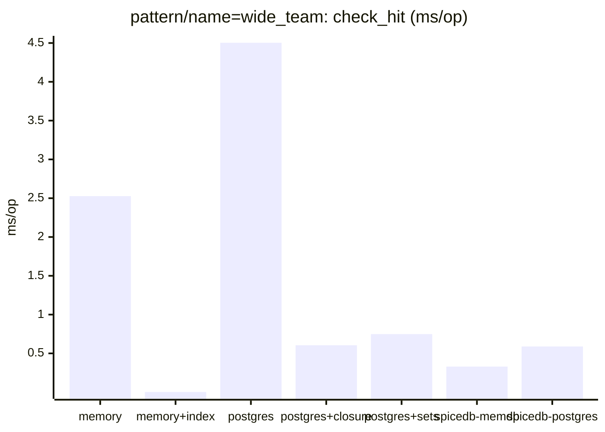
```mermaid
xychart-beta
    title "pattern/name=wide_team: check_hit (ms/op)"
    x-axis ["memory", "memory+index", "postgres", "postgres+closure", "postgres+sets", "spicedb-memdb", "spicedb-postgres"]
    y-axis "ms/op"
    bar [2.527, 0.002, 4.504, 0.605, 0.749, 0.330, 0.589]
```

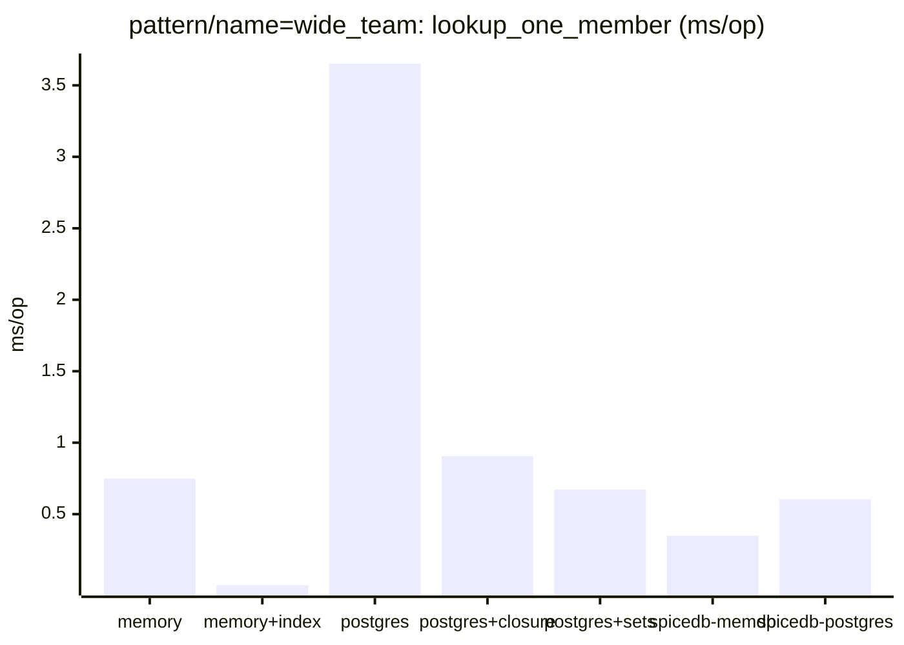
```mermaid
xychart-beta
    title "pattern/name=wide_team: lookup_one_member (ms/op)"
    x-axis ["memory", "memory+index", "postgres", "postgres+closure", "postgres+sets", "spicedb-memdb", "spicedb-postgres"]
    y-axis "ms/op"
    bar [0.749, 0.002, 3.651, 0.905, 0.672, 0.349, 0.604]
```

## pattern/name=deep_nesting

| op | memory | memory+index | postgres | postgres+closure | postgres+sets | spicedb-memdb | spicedb-postgres |
|---|---:|---:|---:|---:|---:|---:|---:|
| check_hit | 199.7 µs | 4.8 µs | 15.3 ms | 1.3 ms | 785.8 µs | | |
| check_miss | 195.3 µs | 4.9 µs | 14.4 ms | 1.6 ms | 767.0 µs | | |
| lookup_all_teams | 5.9 ms | 26.3 µs | 37.8 ms | 1.6 ms | 1.6 ms | | |
| subjects_at_top | 220.4 µs | 5.5 µs | 14.9 ms | 1.5 ms | 751.2 µs | | |
| toggle_top_edge | 16.3 µs (0.02×) | 16.1 µs (0.00×) | 16.4 ms (1.15×) | 91.2 ms (6.41×) | 54.3 ms (3.81×) | 782.5 µs | 14.2 ms |
| toggle_bottom_edge | 16.2 µs (0.02×) | 16.1 µs (0.00×) | 7.6 ms (0.59×) | 19.3 ms (1.50×) | 13.1 ms (1.01×) | 795.6 µs | 12.9 ms |

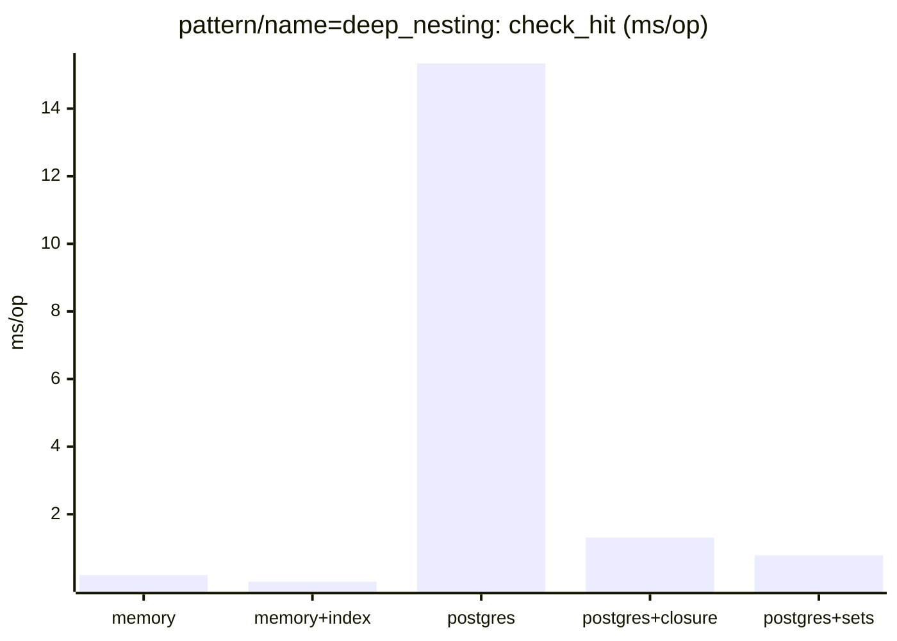
```mermaid
xychart-beta
    title "pattern/name=deep_nesting: check_hit (ms/op)"
    x-axis ["memory", "memory+index", "postgres", "postgres+closure", "postgres+sets"]
    y-axis "ms/op"
    bar [0.200, 0.005, 15.338, 1.310, 0.786]
```

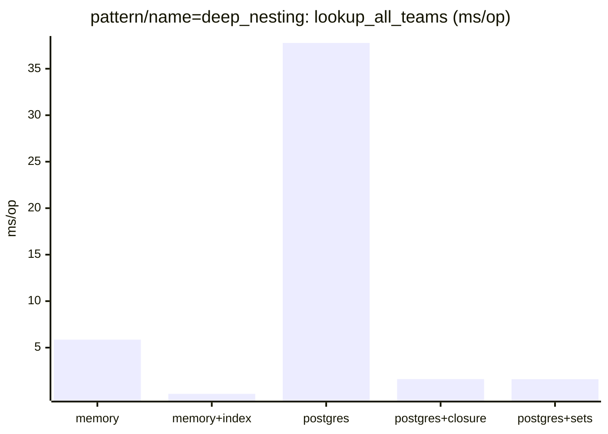
```mermaid
xychart-beta
    title "pattern/name=deep_nesting: lookup_all_teams (ms/op)"
    x-axis ["memory", "memory+index", "postgres", "postgres+closure", "postgres+sets"]
    y-axis "ms/op"
    bar [5.858, 0.026, 37.778, 1.617, 1.602]
```

## pattern/name=hub_user

| op | memory | memory+index | postgres | postgres+closure | postgres+sets | spicedb-memdb | spicedb-postgres |
|---|---:|---:|---:|---:|---:|---:|---:|
| lookup_hub | 848.7 µs (1.32×) | 19.8 µs (0.02×) | 1.9 ms (2.37×) | 846.1 µs (1.03×) | 652.1 µs (0.79×) | 644.2 µs | 822.6 µs |
| lookup_single_owner | 430.3 µs (1.21×) | 1.9 µs (0.00×) | 1.1 ms (1.65×) | 824.4 µs (1.28×) | 536.4 µs (0.83×) | 356.2 µs | 643.8 µs |
| check_miss | 140.2 µs (0.42×) | 1.6 µs (0.00×) | 410.3 µs (0.68×) | 938.2 µs (1.55×) | 705.0 µs (1.16×) | 334.9 µs | 606.3 µs |

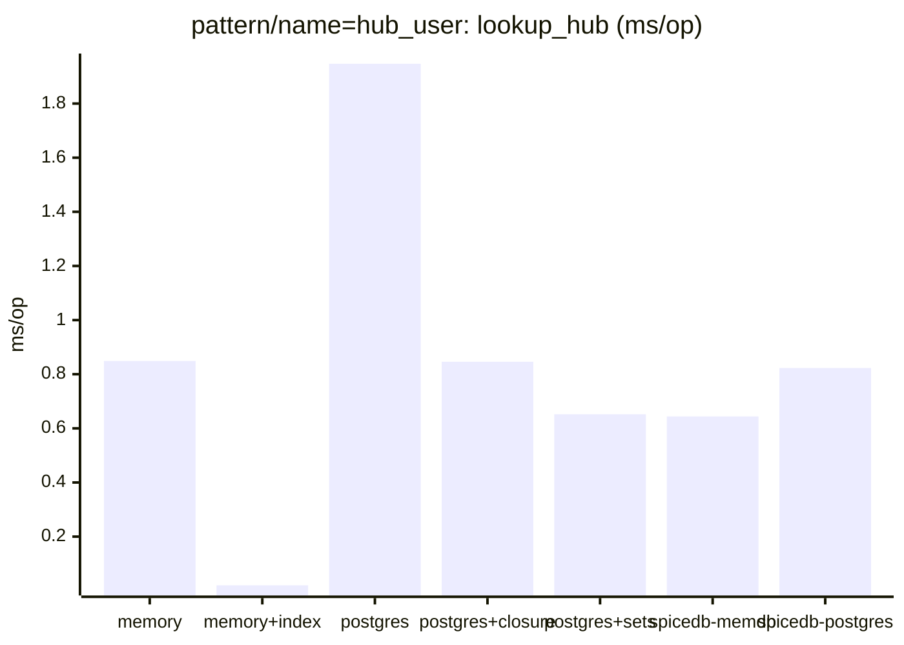
```mermaid
xychart-beta
    title "pattern/name=hub_user: lookup_hub (ms/op)"
    x-axis ["memory", "memory+index", "postgres", "postgres+closure", "postgres+sets", "spicedb-memdb", "spicedb-postgres"]
    y-axis "ms/op"
    bar [0.849, 0.020, 1.947, 0.846, 0.652, 0.644, 0.823]
```

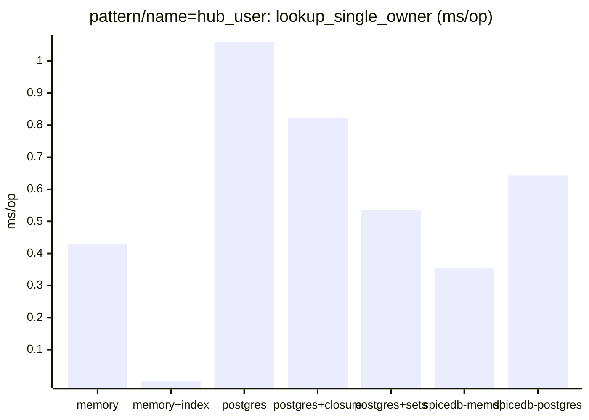
```mermaid
xychart-beta
    title "pattern/name=hub_user: lookup_single_owner (ms/op)"
    x-axis ["memory", "memory+index", "postgres", "postgres+closure", "postgres+sets", "spicedb-memdb", "spicedb-postgres"]
    y-axis "ms/op"
    bar [0.430, 0.002, 1.061, 0.824, 0.536, 0.356, 0.644]
```

## pattern/name=needle

| op | memory | memory+index | postgres | postgres+closure | postgres+sets | spicedb-memdb | spicedb-postgres |
|---|---:|---:|---:|---:|---:|---:|---:|
| lookup_needle | 2.2 ms (6.22×) | 2.0 µs (0.00×) | 1.0 ms (1.69×) | 816.2 µs (1.34×) | 554.0 µs (0.91×) | 347.9 µs | 610.5 µs |
| check_needle | 785.9 µs (2.41×) | 1.7 µs (0.00×) | 413.1 µs (0.70×) | 845.7 µs (1.43×) | 731.9 µs (1.24×) | 326.5 µs | 591.6 µs |
| lookup_nobody | 1.1 ms (3.20×) | 1.5 µs (0.00×) | 636.1 µs (1.10×) | 795.3 µs (1.37×) | 642.9 µs (1.11×) | 330.7 µs | 580.1 µs |

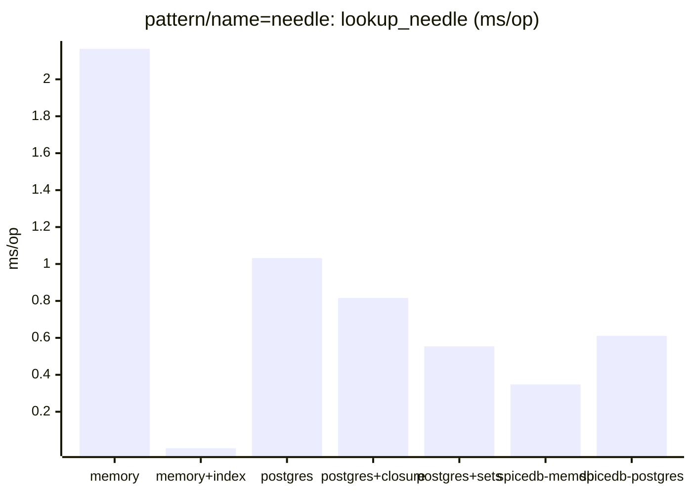
```mermaid
xychart-beta
    title "pattern/name=needle: lookup_needle (ms/op)"
    x-axis ["memory", "memory+index", "postgres", "postgres+closure", "postgres+sets", "spicedb-memdb", "spicedb-postgres"]
    y-axis "ms/op"
    bar [2.165, 0.002, 1.032, 0.816, 0.554, 0.348, 0.611]
```

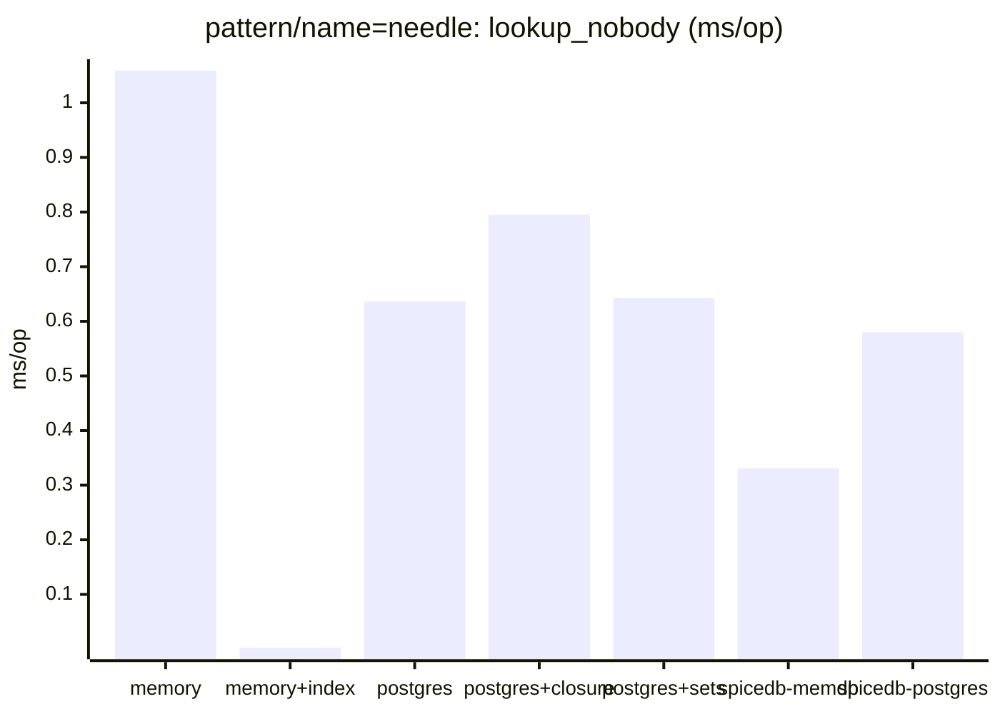
```mermaid
xychart-beta
    title "pattern/name=needle: lookup_nobody (ms/op)"
    x-axis ["memory", "memory+index", "postgres", "postgres+closure", "postgres+sets", "spicedb-memdb", "spicedb-postgres"]
    y-axis "ms/op"
    bar [1.059, 0.002, 0.636, 0.795, 0.643, 0.331, 0.580]
```

## pattern/name=fan_in

| op | memory | memory+index | postgres | postgres+closure | postgres+sets | spicedb-memdb | spicedb-postgres |
|---|---:|---:|---:|---:|---:|---:|---:|
| check_last | 6.8 ms (20.2×) | 21.1 µs (0.04×) | 59.1 ms (103×) | 579.3 µs (1.01×) | 734.0 µs (1.28×) | 339.1 µs | 572.7 µs |
| check_miss | 7.6 ms (23.2×) | 19.9 µs (0.03×) | 62.7 ms (108×) | 971.0 µs (1.67×) | 776.8 µs (1.34×) | 328.7 µs | 581.2 µs |
| subjects_teams | 17.2 ms (6.62×) | 228.6 µs (0.09×) | 77.1 ms (29.1×) | 2.1 ms (0.79×) | 2.0 ms (0.76×) | 2.6 ms | 2.7 ms |
| subjects_users | 16.9 ms (11.2×) | 180.2 µs (0.10×) | 78.7 ms (41.5×) | 2.1 ms (1.10×) | 1.5 ms (0.78×) | 1.5 ms | 1.9 ms |
| lookup_one | 514.6 µs (1.43×) | 2.0 µs (0.00×) | 3.4 ms (5.64×) | 787.6 µs (1.30×) | 584.0 µs (0.97×) | 361.1 µs | 604.9 µs |

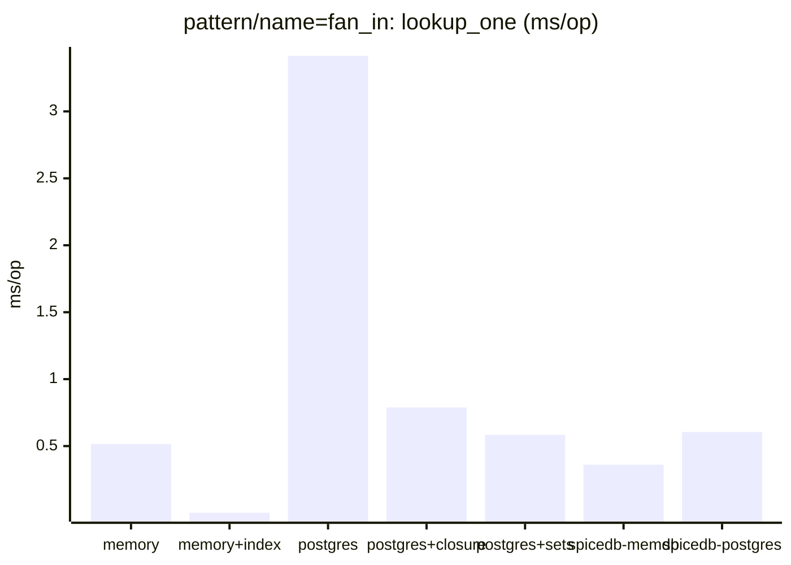
```mermaid
xychart-beta
    title "pattern/name=fan_in: lookup_one (ms/op)"
    x-axis ["memory", "memory+index", "postgres", "postgres+closure", "postgres+sets", "spicedb-memdb", "spicedb-postgres"]
    y-axis "ms/op"
    bar [0.515, 0.002, 3.415, 0.788, 0.584, 0.361, 0.605]
```

## pattern/name=dag

| op | memory | memory+index | postgres | postgres+closure | postgres+sets | spicedb-memdb | spicedb-postgres |
|---|---:|---:|---:|---:|---:|---:|---:|
| check_top | 151.9 µs (0.45×) | 2.5 µs (0.00×) | 968.1 µs (1.65×) | 586.5 µs (1.00×) | 799.6 µs (1.36×) | 339.9 µs | 586.5 µs |
| lookup_all_layers | 4.5 ms (6.39×) | 18.1 µs (0.02×) | 5.5 ms (5.86×) | 610.4 µs (0.65×) | 580.2 µs (0.62×) | 699.4 µs | 936.4 µs |
| toggle_bottom_edge | 189.5 µs (0.24×) | 185.3 µs (0.01×) | 5.7 ms (0.19×) | 20.8 ms (0.68×) | 17.8 ms (0.58×) | 775.0 µs | 30.5 ms |

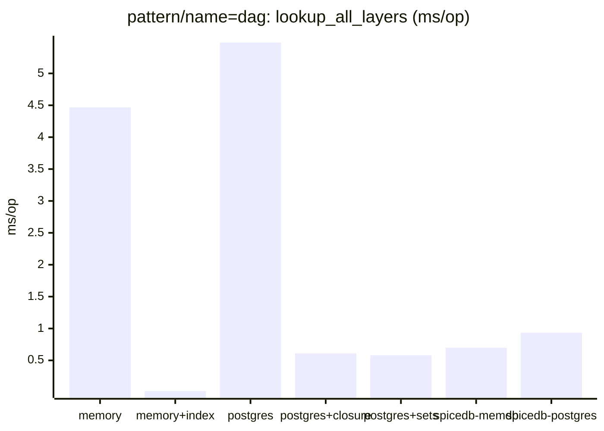
```mermaid
xychart-beta
    title "pattern/name=dag: lookup_all_layers (ms/op)"
    x-axis ["memory", "memory+index", "postgres", "postgres+closure", "postgres+sets", "spicedb-memdb", "spicedb-postgres"]
    y-axis "ms/op"
    bar [4.466, 0.018, 5.483, 0.610, 0.580, 0.699, 0.936]
```

## pattern/name=arrow_chain

| op | memory | memory+index | postgres | postgres+closure | postgres+sets | spicedb-memdb | spicedb-postgres |
|---|---:|---:|---:|---:|---:|---:|---:|
| check_leaf | 65.6 µs (0.19×) | 2.4 µs (0.00×) | 8.1 ms (13.6×) | 13.5 ms (22.6×) | 771.8 µs (1.29×) | 343.0 µs | 596.1 µs |
| check_miss | 66.6 µs (0.20×) | 3.3 µs (0.01×) | 7.9 ms (12.0×) | 14.3 ms (21.9×) | 699.9 µs (1.07×) | 327.5 µs | 653.6 µs |
| lookup_all_folders | 425.1 µs (0.69×) | 10.6 µs (0.01×) | 8.0 ms (9.45×) | 12.6 ms (14.8×) | 844.9 µs (0.99×) | 614.5 µs | 850.5 µs |
| subjects_leaf | 82.9 µs (0.25×) | 3.6 µs (0.01×) | 7.2 ms (12.3×) | 13.3 ms (22.6×) | 702.8 µs (1.20×) | 335.7 µs | 587.2 µs |

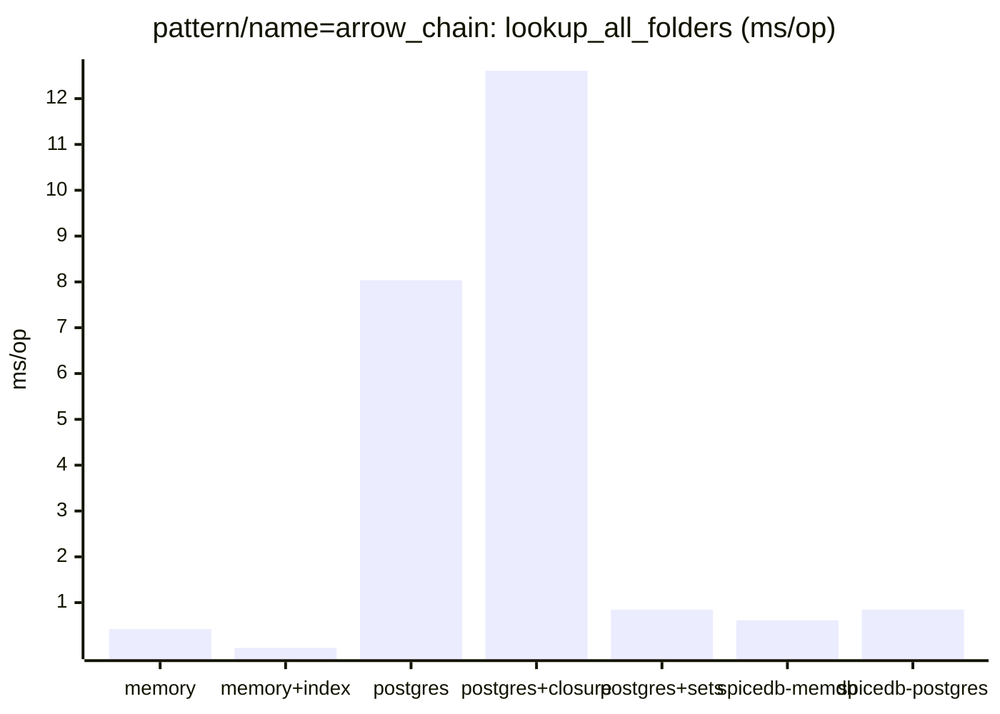
```mermaid
xychart-beta
    title "pattern/name=arrow_chain: lookup_all_folders (ms/op)"
    x-axis ["memory", "memory+index", "postgres", "postgres+closure", "postgres+sets", "spicedb-memdb", "spicedb-postgres"]
    y-axis "ms/op"
    bar [0.425, 0.011, 8.037, 12.612, 0.845, 0.615, 0.850]
```

## pattern/name=wildcard_ban

| op | memory | memory+index | postgres | postgres+closure | postgres+sets | spicedb-memdb | spicedb-postgres |
|---|---:|---:|---:|---:|---:|---:|---:|
| check_unbanned | 7.3 ms (20.6×) | 43.0 µs (0.07×) | 3.1 ms (5.25×) | 926.7 µs (1.58×) | 941.8 µs (1.60×) | 355.1 µs | 587.1 µs |
| check_banned | 7.2 ms (22.2×) | 44.9 µs (0.08×) | 3.1 ms (5.11×) | 892.7 µs (1.49×) | 923.1 µs (1.54×) | 323.2 µs | 598.4 µs |
| subjects_wildcard_minus | 8.5 ms (2.61×) | 2.2 ms (0.72×) | 4.3 ms (1.43×) | 16.5 ms (5.41×) | 16.3 ms (5.37×) | 3.2 ms | 3.0 ms |
| lookup_banned | 220.3 µs (0.69×) | 2.4 µs (0.00×) | 600.8 µs (1.04×) | 786.9 µs (1.36×) | 792.4 µs (1.37×) | 320.7 µs | 579.3 µs |
| lookup_unbanned | 238.2 µs (0.68×) | 2.3 µs (0.00×) | 562.0 µs (0.93×) | 811.9 µs (1.35×) | 746.9 µs (1.24×) | 349.0 µs | 602.0 µs |

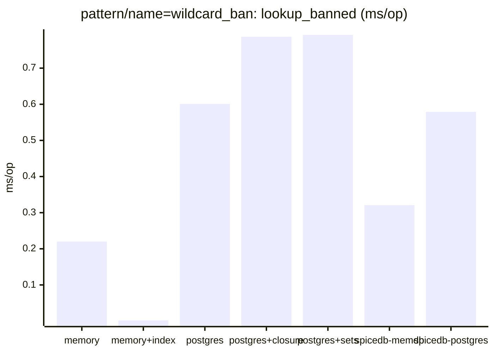
```mermaid
xychart-beta
    title "pattern/name=wildcard_ban: lookup_banned (ms/op)"
    x-axis ["memory", "memory+index", "postgres", "postgres+closure", "postgres+sets", "spicedb-memdb", "spicedb-postgres"]
    y-axis "ms/op"
    bar [0.220, 0.002, 0.601, 0.787, 0.792, 0.321, 0.579]
```

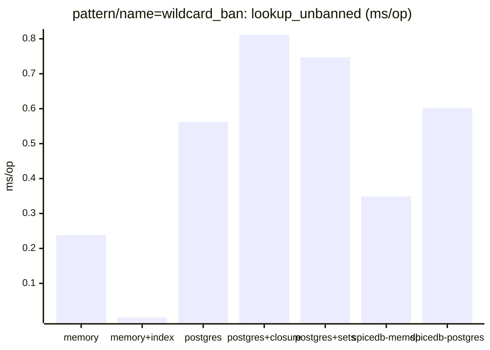
```mermaid
xychart-beta
    title "pattern/name=wildcard_ban: lookup_unbanned (ms/op)"
    x-axis ["memory", "memory+index", "postgres", "postgres+closure", "postgres+sets", "spicedb-memdb", "spicedb-postgres"]
    y-axis "ms/op"
    bar [0.238, 0.002, 0.562, 0.812, 0.747, 0.349, 0.602]
```

## scale/resources=1000/density=10/path=direct

| op | memory | memory+index | postgres | postgres+closure | postgres+sets | spicedb-memdb | spicedb-postgres |
|---|---:|---:|---:|---:|---:|---:|---:|
| lookup | 907.9 µs (1.00×) | 38.4 µs (0.03×) | 2.1 ms (1.73×) | 1.0 ms (0.84×) | 870.3 µs (0.71×) | 909.1 µs | 1.2 ms |
| check_hit | 45.0 µs (0.13×) | 1.6 µs (0.00×) | 306.2 µs (0.48×) | 604.8 µs (0.95×) | 933.4 µs (1.47×) | 339.0 µs | 635.2 µs |
| check_miss | 86.3 µs (0.26×) | 1.6 µs (0.00×) | 455.5 µs (0.71×) | 1.0 ms (1.55×) | 928.9 µs (1.44×) | 333.1 µs | 644.2 µs |
| bulk_100 | 960.9 µs (0.77×) | 182.5 µs (0.12×) | 1.8 ms (1.13×) | 2.6 ms (1.68×) | 2.2 ms (1.42×) | 1.2 ms | 1.6 ms |
| subjects_one | 87.8 µs (0.24×) | 2.2 µs (0.00×) | 454.6 µs (0.70×) | 971.8 µs (1.50×) | 564.7 µs (0.87×) | 360.2 µs | 648.5 µs |
| toggle_grant | 413.5 µs (0.49×) | 404.7 µs (0.03×) | 6.0 ms (0.52×) | 6.1 ms (0.53×) | 24.1 ms (2.08×) | 841.8 µs | 11.6 ms |

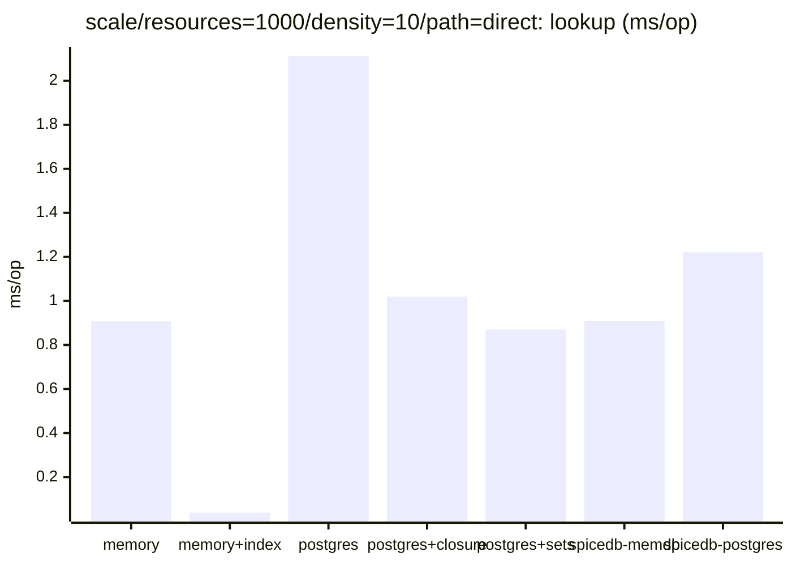
```mermaid
xychart-beta
    title "scale/resources=1000/density=10/path=direct: lookup (ms/op)"
    x-axis ["memory", "memory+index", "postgres", "postgres+closure", "postgres+sets", "spicedb-memdb", "spicedb-postgres"]
    y-axis "ms/op"
    bar [0.908, 0.038, 2.113, 1.020, 0.870, 0.909, 1.221]
```

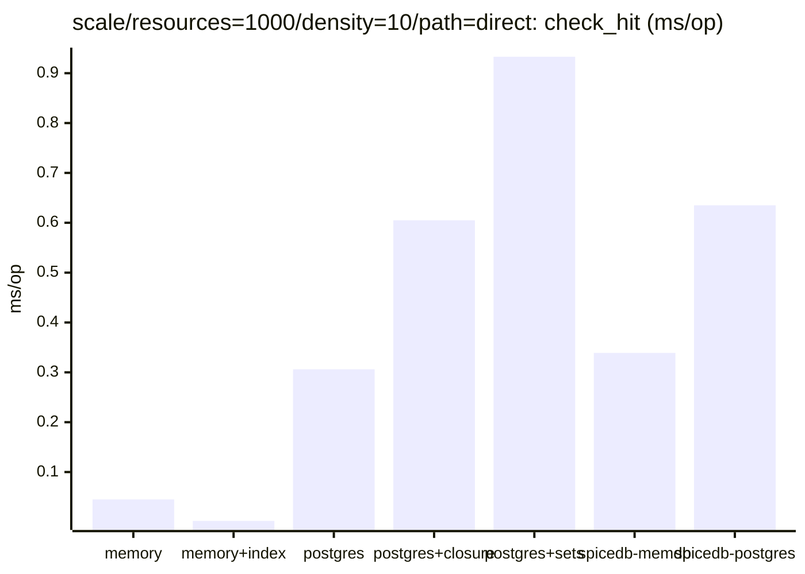
```mermaid
xychart-beta
    title "scale/resources=1000/density=10/path=direct: check_hit (ms/op)"
    x-axis ["memory", "memory+index", "postgres", "postgres+closure", "postgres+sets", "spicedb-memdb", "spicedb-postgres"]
    y-axis "ms/op"
    bar [0.045, 0.002, 0.306, 0.605, 0.933, 0.339, 0.635]
```

## scale/resources=1000/density=90/path=direct

| op | memory | memory+index | postgres | postgres+closure | postgres+sets | spicedb-memdb | spicedb-postgres |
|---|---:|---:|---:|---:|---:|---:|---:|
| lookup | 5.5 ms (1.15×) | 485.8 µs (0.10×) | 6.3 ms (1.27×) | 2.0 ms (0.40×) | 2.0 ms (0.40×) | 4.8 ms | 5.0 ms |
| check_hit | 62.1 µs (0.19×) | 1.6 µs (0.00×) | 307.9 µs (0.51×) | 609.7 µs (1.00×) | 898.5 µs (1.48×) | 327.3 µs | 608.8 µs |
| check_miss | 120.8 µs (0.37×) | 1.6 µs (0.00×) | 464.6 µs (0.78×) | 997.0 µs (1.67×) | 868.0 µs (1.45×) | 326.1 µs | 597.3 µs |
| bulk_100 | 1.1 ms (0.91×) | 560.7 µs (0.39×) | 1.8 ms (1.27×) | 2.7 ms (1.86×) | 2.7 ms (1.88×) | 1.2 ms | 1.4 ms |
| subjects_one | 123.1 µs (0.33×) | 2.3 µs (0.00×) | 428.9 µs (0.72×) | 942.7 µs (1.57×) | 580.4 µs (0.97×) | 372.1 µs | 599.0 µs |
| toggle_grant | 784.6 µs (1.03×) | 835.6 µs (0.09×) | 29.2 ms (3.13×) | 7.6 ms (0.82×) | 11.7 ms (1.26×) | 765.0 µs | 9.3 ms |

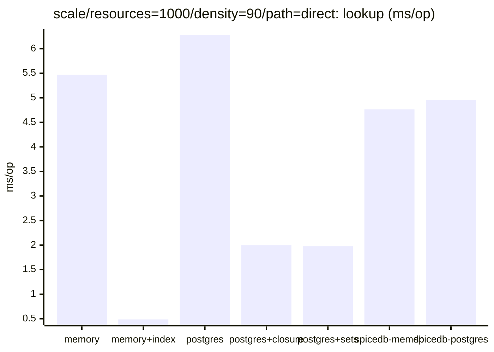
```mermaid
xychart-beta
    title "scale/resources=1000/density=90/path=direct: lookup (ms/op)"
    x-axis ["memory", "memory+index", "postgres", "postgres+closure", "postgres+sets", "spicedb-memdb", "spicedb-postgres"]
    y-axis "ms/op"
    bar [5.470, 0.486, 6.283, 1.995, 1.978, 4.765, 4.952]
```

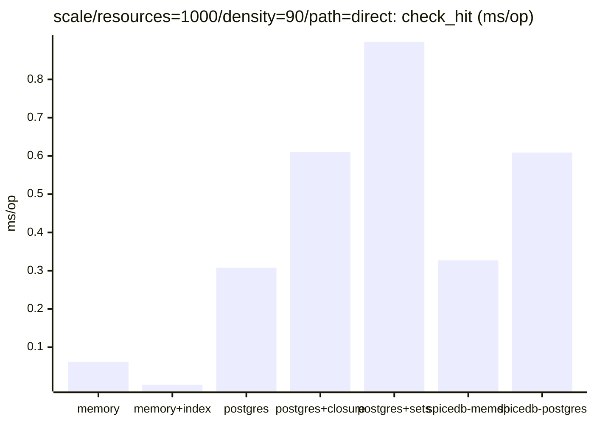
```mermaid
xychart-beta
    title "scale/resources=1000/density=90/path=direct: check_hit (ms/op)"
    x-axis ["memory", "memory+index", "postgres", "postgres+closure", "postgres+sets", "spicedb-memdb", "spicedb-postgres"]
    y-axis "ms/op"
    bar [0.062, 0.002, 0.308, 0.610, 0.898, 0.327, 0.609]
```

## scale/resources=1000/density=10/path=team

| op | memory | memory+index | postgres | postgres+closure | postgres+sets | spicedb-memdb | spicedb-postgres |
|---|---:|---:|---:|---:|---:|---:|---:|
| lookup | 1.5 ms (1.60×) | 41.2 µs (0.03×) | 3.8 ms (3.09×) | 926.0 µs (0.76×) | 805.5 µs (0.66×) | 938.8 µs | 1.2 ms |
| check_hit | 77.5 µs (0.22×) | 1.9 µs (0.00×) | 448.6 µs (0.71×) | 559.3 µs (0.88×) | 789.5 µs (1.24×) | 352.5 µs | 635.2 µs |
| check_miss | 86.4 µs (0.23×) | 1.7 µs (0.00×) | 473.8 µs (0.74×) | 915.1 µs (1.43×) | 784.7 µs (1.22×) | 371.0 µs | 642.1 µs |
| bulk_100 | 1.0 ms (0.82×) | 171.0 µs (0.11×) | 1.9 ms (1.22×) | 2.2 ms (1.39×) | 2.3 ms (1.44×) | 1.3 ms | 1.6 ms |
| subjects_one | 88.1 µs (0.25×) | 2.2 µs (0.00×) | 447.2 µs (0.73×) | 881.8 µs (1.44×) | 627.1 µs (1.02×) | 350.9 µs | 612.6 µs |
| toggle_team_edge | 461.5 µs (0.57×) | 408.1 µs (0.03×) | 4.9 ms (0.40×) | 10.2 ms (0.83×) | 15.6 ms (1.26×) | 811.7 µs | 12.3 ms |

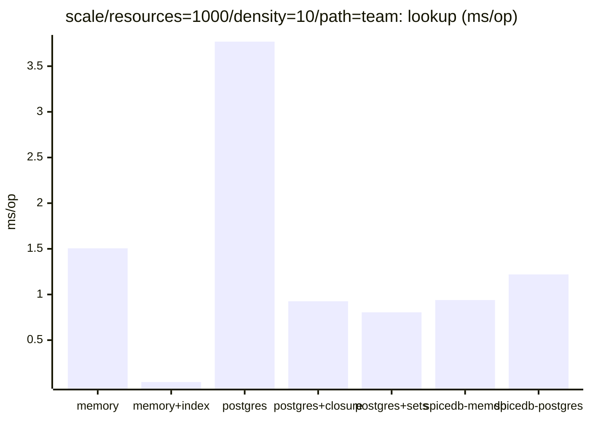
```mermaid
xychart-beta
    title "scale/resources=1000/density=10/path=team: lookup (ms/op)"
    x-axis ["memory", "memory+index", "postgres", "postgres+closure", "postgres+sets", "spicedb-memdb", "spicedb-postgres"]
    y-axis "ms/op"
    bar [1.506, 0.041, 3.769, 0.926, 0.805, 0.939, 1.220]
```

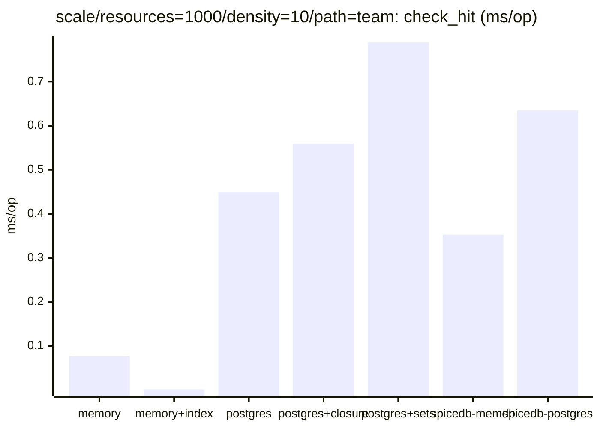
```mermaid
xychart-beta
    title "scale/resources=1000/density=10/path=team: check_hit (ms/op)"
    x-axis ["memory", "memory+index", "postgres", "postgres+closure", "postgres+sets", "spicedb-memdb", "spicedb-postgres"]
    y-axis "ms/op"
    bar [0.077, 0.002, 0.449, 0.559, 0.789, 0.353, 0.635]
```

## scale/resources=10000/density=10/path=direct

| op | memory | memory+index | postgres | postgres+closure | postgres+sets | spicedb-memdb | spicedb-postgres |
|---|---:|---:|---:|---:|---:|---:|---:|
| lookup | 11.2 ms (2.18×) | 521.8 µs (0.10×) | 7.6 ms (1.40×) | 2.2 ms (0.42×) | 2.3 ms (0.42×) | 5.2 ms | 5.4 ms |
| check_hit | 561.8 µs (1.69×) | 1.6 µs (0.00×) | 288.8 µs (0.49×) | 569.8 µs (0.97×) | 711.2 µs (1.21×) | 332.7 µs | 589.8 µs |
| check_miss | 1.0 ms (3.06×) | 1.8 µs (0.00×) | 416.2 µs (0.64×) | 880.3 µs (1.36×) | 713.6 µs (1.10×) | 341.2 µs | 648.8 µs |
| bulk_100 | 3.8 ms (3.28×) | 597.3 µs (0.42×) | 1.7 ms (1.20×) | 2.5 ms (1.75×) | 2.6 ms (1.85×) | 1.2 ms | 1.4 ms |
| subjects_one | 1.0 ms (2.71×) | 2.2 µs (0.00×) | 470.6 µs (0.79×) | 844.0 µs (1.41×) | 589.4 µs (0.98×) | 386.0 µs | 599.0 µs |
| toggle_grant | 11.2 ms (13.3×) | 15.1 ms (1.15×) | 12.2 ms (0.93×) | 8.2 ms (0.62×) | 11.2 ms (0.85×) | 841.8 µs | 13.1 ms |

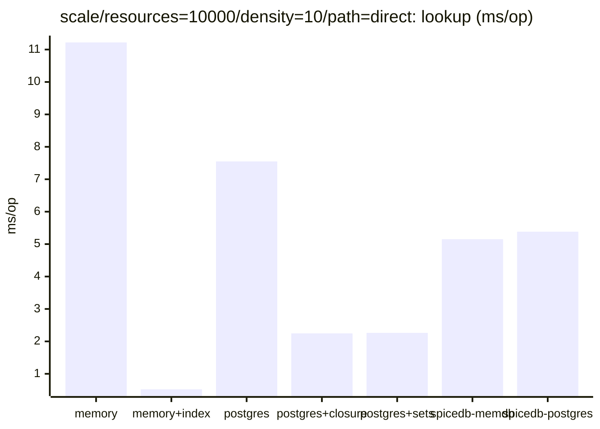
```mermaid
xychart-beta
    title "scale/resources=10000/density=10/path=direct: lookup (ms/op)"
    x-axis ["memory", "memory+index", "postgres", "postgres+closure", "postgres+sets", "spicedb-memdb", "spicedb-postgres"]
    y-axis "ms/op"
    bar [11.220, 0.522, 7.550, 2.247, 2.263, 5.152, 5.383]
```

```mermaid
xychart-beta
    title "scale/resources=10000/density=10/path=direct: check_hit (ms/op)"
    x-axis ["memory", "memory+index", "postgres", "postgres+closure", "postgres+sets", "spicedb-memdb", "spicedb-postgres"]
    y-axis "ms/op"
    bar [0.562, 0.002, 0.289, 0.570, 0.711, 0.333, 0.590]
```

## scale/resources=10000/density=90/path=direct

| op | memory | memory+index | postgres | postgres+closure | postgres+sets | spicedb-memdb | spicedb-postgres |
|---|---:|---:|---:|---:|---:|---:|---:|
| lookup | 66.3 ms (1.34×) | 5.3 ms (0.12×) | 52.2 ms (1.22×) | 14.3 ms (0.33×) | 14.7 ms (0.34×) | 49.4 ms | 43.0 ms |
| check_hit | 670.0 µs (2.02×) | 1.6 µs (0.00×) | 308.2 µs (0.53×) | 622.4 µs (1.06×) | 735.6 µs (1.26×) | 331.4 µs | 585.7 µs |
| check_miss | 1.3 ms (3.89×) | 1.6 µs (0.00×) | 396.3 µs (0.67×) | 974.5 µs (1.65×) | 741.6 µs (1.26×) | 329.5 µs | 590.9 µs |
| bulk_100 | 3.6 ms (3.13×) | 3.6 ms (2.45×) | 1.6 ms (1.12×) | 3.3 ms (2.28×) | 5.7 ms (3.88×) | 1.2 ms | 1.5 ms |
| subjects_one | 1.2 ms (3.38×) | 2.1 µs (0.00×) | 422.6 µs (0.69×) | 913.3 µs (1.48×) | 581.3 µs (0.94×) | 350.1 µs | 615.6 µs |
| toggle_grant | 12.5 ms (16.0×) | 12.1 ms (0.61×) | 24.4 ms (1.24×) | 6.6 ms (0.34×) | 33.1 ms (1.69×) | 779.1 µs | 19.6 ms |

```mermaid
xychart-beta
    title "scale/resources=10000/density=90/path=direct: lookup (ms/op)"
    x-axis ["memory", "memory+index", "postgres", "postgres+closure", "postgres+sets", "spicedb-memdb", "spicedb-postgres"]
    y-axis "ms/op"
    bar [66.317, 5.259, 52.226, 14.349, 14.686, 49.421, 42.963]
```

```mermaid
xychart-beta
    title "scale/resources=10000/density=90/path=direct: check_hit (ms/op)"
    x-axis ["memory", "memory+index", "postgres", "postgres+closure", "postgres+sets", "spicedb-memdb", "spicedb-postgres"]
    y-axis "ms/op"
    bar [0.670, 0.002, 0.308, 0.622, 0.736, 0.331, 0.586]
```

## scale/resources=10000/density=10/path=team

| op | memory | memory+index | postgres | postgres+closure | postgres+sets | spicedb-memdb | spicedb-postgres |
|---|---:|---:|---:|---:|---:|---:|---:|
| lookup | 20.3 ms (3.25×) | 523.6 µs (0.09×) | 8.9 ms (1.53×) | 2.4 ms (0.41×) | 2.3 ms (0.39×) | 6.2 ms | 5.8 ms |
| check_hit | 958.7 µs (2.89×) | 1.7 µs (0.00×) | 503.9 µs (0.86×) | 585.2 µs (1.00×) | 1.2 ms (2.00×) | 331.4 µs | 584.4 µs |
| check_miss | 1.0 ms (3.11×) | 1.6 µs (0.00×) | 390.8 µs (0.66×) | 897.6 µs (1.51×) | 1.1 ms (1.89×) | 327.6 µs | 594.0 µs |
| bulk_100 | 4.3 ms (3.71×) | 530.1 µs (0.37×) | 1.8 ms (1.27×) | 2.1 ms (1.50×) | 2.6 ms (1.85×) | 1.1 ms | 1.4 ms |
| subjects_one | 1.0 ms (2.90×) | 2.2 µs (0.00×) | 460.0 µs (0.75×) | 838.8 µs (1.36×) | 675.0 µs (1.10×) | 348.7 µs | 615.5 µs |
| toggle_team_edge | 11.0 ms (12.6×) | 11.1 ms (0.56×) | 9.6 ms (0.48×) | 47.1 ms (2.36×) | 22.4 ms (1.13×) | 872.5 µs | 19.9 ms |

```mermaid
xychart-beta
    title "scale/resources=10000/density=10/path=team: lookup (ms/op)"
    x-axis ["memory", "memory+index", "postgres", "postgres+closure", "postgres+sets", "spicedb-memdb", "spicedb-postgres"]
    y-axis "ms/op"
    bar [20.336, 0.524, 8.929, 2.392, 2.254, 6.250, 5.843]
```

```mermaid
xychart-beta
    title "scale/resources=10000/density=10/path=team: check_hit (ms/op)"
    x-axis ["memory", "memory+index", "postgres", "postgres+closure", "postgres+sets", "spicedb-memdb", "spicedb-postgres"]
    y-axis "ms/op"
    bar [0.959, 0.002, 0.504, 0.585, 1.170, 0.331, 0.584]
```

## scale/resources=100000/density=10/path=direct

| op | memory | memory+index | postgres | postgres+closure | postgres+sets | spicedb-memdb | spicedb-postgres |
|---|---:|---:|---:|---:|---:|---:|---:|
| lookup | 151.4 ms (3.15×) | 1.38 s (30.4×) | 66.9 ms (1.47×) | 15.6 ms (0.34×) | 17.6 ms (0.39×) | 48.0 ms | 45.5 ms |
| check_hit | 4.9 ms (13.7×) | 1.5 µs (0.00×) | 355.3 µs (0.60×) | 542.4 µs (0.92×) | 734.5 µs (1.25×) | 355.6 µs | 588.3 µs |
| check_miss | 9.9 ms (28.6×) | 1.6 µs (0.00×) | 436.6 µs (0.74×) | 825.3 µs (1.40×) | 719.3 µs (1.22×) | 345.4 µs | 588.7 µs |
| bulk_100 | 33.4 ms (0.10×) | 4.2 ms (3.02×) | 1.7 ms (1.19×) | 2.9 ms (2.05×) | 8.9 ms (6.33×) | 344.0 ms | 1.4 ms |
| subjects_one | 10.2 ms (25.3×) | 2.3 µs (0.00×) | 448.4 µs (0.73×) | 864.7 µs (1.41×) | 591.2 µs (0.97×) | 404.2 µs | 611.1 µs |
| toggle_grant | 134.3 ms (169×) | 175.2 ms (27.4×) | 5.0 ms (0.78×) | 7.0 ms (1.09×) | 14.6 ms (2.28×) | 793.2 µs | 6.4 ms |

```mermaid
xychart-beta
    title "scale/resources=100000/density=10/path=direct: lookup (ms/op)"
    x-axis ["memory", "memory+index", "postgres", "postgres+closure", "postgres+sets", "spicedb-memdb", "spicedb-postgres"]
    y-axis "ms/op"
    bar [151.373, 1381.964, 66.935, 15.623, 17.564, 48.045, 45.485]
```

```mermaid
xychart-beta
    title "scale/resources=100000/density=10/path=direct: check_hit (ms/op)"
    x-axis ["memory", "memory+index", "postgres", "postgres+closure", "postgres+sets", "spicedb-memdb", "spicedb-postgres"]
    y-axis "ms/op"
    bar [4.871, 0.002, 0.355, 0.542, 0.735, 0.356, 0.588]
```

## scale/resources=100000/density=90/path=direct

| op | memory | memory+index | postgres | postgres+closure | postgres+sets | spicedb-memdb | spicedb-postgres |
|---|---:|---:|---:|---:|---:|---:|---:|
| lookup | 948.1 ms (1.46×) | 1.80 s (2.80×) | 585.5 ms (0.91×) | 160.7 ms (0.25×) | 261.2 ms (0.41×) | 651.6 ms | 640.2 ms |
| check_hit | 5.8 ms (17.7×) | 1.6 µs (0.00×) | 363.6 µs (0.62×) | 574.7 µs (0.98×) | 771.1 µs (1.31×) | 325.1 µs | 588.9 µs |
| check_miss | 12.0 ms (37.0×) | 1.5 µs (0.00×) | 465.2 µs (0.78×) | 948.4 µs (1.58×) | 775.4 µs (1.29×) | 324.6 µs | 600.1 µs |
| bulk_100 | 30.2 ms (0.09×) | 42.3 ms (29.7×) | 1.6 ms (1.14×) | 3.2 ms (2.22×) | 3.9 ms (2.73×) | 346.2 ms | 1.4 ms |
| subjects_one | 11.6 ms (33.5×) | 2.1 µs (0.00×) | 420.1 µs (0.70×) | 883.6 µs (1.48×) | 669.2 µs (1.12×) | 346.6 µs | 596.9 µs |
| toggle_grant | 150.3 ms (187×) | 172.6 ms (14.1×) | 7.8 ms (0.63×) | 5.0 ms (0.41×) | 19.2 ms (1.56×) | 803.0 µs | 12.3 ms |

```mermaid
xychart-beta
    title "scale/resources=100000/density=90/path=direct: lookup (ms/op)"
    x-axis ["memory", "memory+index", "postgres", "postgres+closure", "postgres+sets", "spicedb-memdb", "spicedb-postgres"]
    y-axis "ms/op"
    bar [948.076, 1795.055, 585.536, 160.666, 261.167, 651.568, 640.183]
```

```mermaid
xychart-beta
    title "scale/resources=100000/density=90/path=direct: check_hit (ms/op)"
    x-axis ["memory", "memory+index", "postgres", "postgres+closure", "postgres+sets", "spicedb-memdb", "spicedb-postgres"]
    y-axis "ms/op"
    bar [5.761, 0.002, 0.364, 0.575, 0.771, 0.325, 0.589]
```

## scale/resources=100000/density=10/path=team

| op | memory | memory+index | postgres | postgres+closure | postgres+sets | spicedb-memdb | spicedb-postgres |
|---|---:|---:|---:|---:|---:|---:|---:|
| lookup | 223.3 ms (4.45×) | 1.50 s (29.2×) | 69.3 ms (1.34×) | 16.7 ms (0.32×) | 16.9 ms (0.33×) | 50.2 ms | 51.5 ms |
| check_hit | 8.8 ms (27.0×) | 1.8 µs (0.00×) | 482.8 µs (0.83×) | 604.4 µs (1.03×) | 827.6 µs (1.42×) | 327.0 µs | 584.0 µs |
| check_miss | 9.4 ms (26.4×) | 1.6 µs (0.00×) | 512.4 µs (0.86×) | 945.4 µs (1.59×) | 853.2 µs (1.43×) | 357.8 µs | 596.3 µs |
| bulk_100 | 36.6 ms (0.11×) | 4.2 ms (2.98×) | 1.8 ms (1.29×) | 4.0 ms (2.84×) | 8.6 ms (6.14×) | 346.5 ms | 1.4 ms |
| subjects_one | 9.6 ms (27.2×) | 2.2 µs (0.00×) | 384.5 µs (0.64×) | 983.1 µs (1.63×) | 625.6 µs (1.04×) | 351.3 µs | 602.2 µs |
| toggle_team_edge | 115.9 ms (148×) | 154.3 ms (5.77×) | 14.0 ms (0.52×) | 83.4 ms (3.12×) | 110.3 ms (4.13×) | 784.1 µs | 26.7 ms |

```mermaid
xychart-beta
    title "scale/resources=100000/density=10/path=team: lookup (ms/op)"
    x-axis ["memory", "memory+index", "postgres", "postgres+closure", "postgres+sets", "spicedb-memdb", "spicedb-postgres"]
    y-axis "ms/op"
    bar [223.342, 1504.452, 69.271, 16.672, 16.903, 50.216, 51.514]
```

```mermaid
xychart-beta
    title "scale/resources=100000/density=10/path=team: check_hit (ms/op)"
    x-axis ["memory", "memory+index", "postgres", "postgres+closure", "postgres+sets", "spicedb-memdb", "spicedb-postgres"]
    y-axis "ms/op"
    bar [8.838, 0.002, 0.483, 0.604, 0.828, 0.327, 0.584]
```

